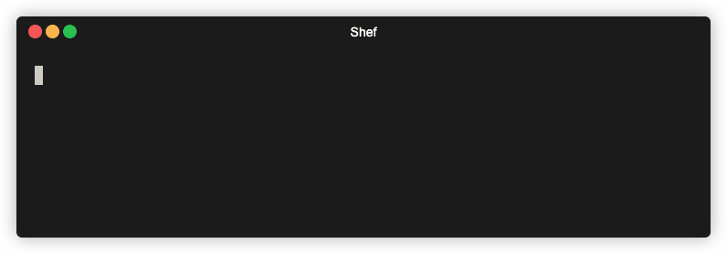
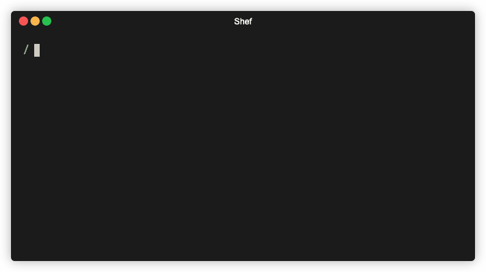
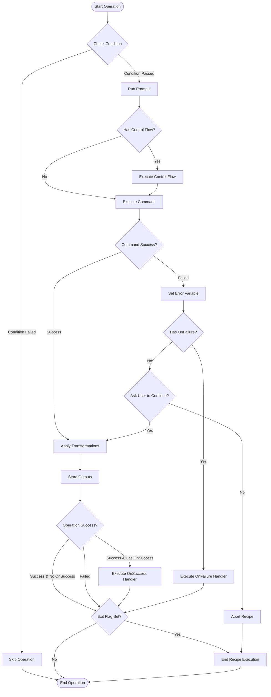

# Shef

Shef, a wordplay on *"shell"* and *"chef"*, is a powerful CLI framework for cooking up advanced shell recipes.

Essentially, imagine that [Make](https://www.gnu.org/software/make), [GitHub Actions](https://github.com/features/actions),
and [CyberChef](https://gchq.github.io/CyberChef) had a weird little `<moira-rose>bea-by</>`.

Shef allows you to pipe shell commands together, add interactive user prompts, loop using complex control structures,
easily run and manage background tasks, and build reusable workflows with advanced logic and conditionals.

## Quick Start Examples

### Hello World

This first example demonstrates a simple recipe that echos "Hello World!" to the terminal.



```yaml
recipes:
  - name: "hello-world"
    description: "A simple hello world recipe"
    operations:
      - name: "Run echo command"
        command: echo "Hello, World!"
```

### Progress Bars

The next [example](https://github.com/eduardoagarcia/shef/blob/main/recipes/demo/progress.yaml) demonstrates progress
bars and loops, where a recipe creates a number of temporary files, and then loops through the directory to clean up
each file it just created.


### Background Tasks

The final [example](https://github.com/eduardoagarcia/shef/blob/main/recipes/demo/background-tasks.yaml) demonstrates
a more advanced recipe where a user selects which background tasks to run and then monitors each task's progress in
real-time.



> [!TIP]
> Want to see more before diving
deeper? [Check out the additional demo recipes.](https://github.com/eduardoagarcia/shef/tree/main/recipes/demo)

## Table of Contents

- [Features](#features)
- [A Note on Bash Scripts, YAML, and Shef](#a-note-on-bash-scripts-yaml-and-shef)
- [Installation](#installation)
- [Quick Start](#quick-start)
- [Command Reference](#command-reference)
- [Recipe Sources](#recipe-sources)
- [Recipe Structure](#recipe-structure)
- [Operation Execution Order](#operation-execution-order)
- [Interactive Prompts](#interactive-user-prompts)
- [Transformations](#transformations)
- [Conditional Execution](#conditional-execution)
- [Branching Workflows](#branching-workflows)
- [Data Flow Between Operations](#data-flow-between-operations)
- [Control Flow Structures](#control-flow-structures)
- [Arguments and Flags](#arguments-and-flags)
- [Recipe Help Documentation](#recipe-help-documentation)
- [Components](#components)
- [Progress Bars](#progress-bars)
- [Example Recipes](#example-recipes)
- [Creating Recipes](#creating-recipes)
- [AI-Assisted Recipe Creation](#ai-assisted-recipe-creation)
- [Troubleshooting](#troubleshooting)
- [Contributing to Shef](#contributing-to-shef)
- [Additional Reference](#additional-reference)

## Features

- **Command Piping**: Chain multiple commands together, passing output from one command to the next
- **Transformations**: Transform command output with powerful templating
- **Interactive Prompts**: Add user input, selections, confirmations, and more
- **Conditional Logic**: Use if/else branching based on command results
- **Control Flow**: Create dynamic workflows with loops and control structures
- **Background Task Management**: Easily monitor and control background tasks
- **Progress Mode**: Inline updates for clean status updates and progress indicators
- **Multiple Sources and Contexts**: Use local, user, or public recipes
- **Public Recipes**: Common, useful recipes anyone can use. Browse
  public [recipes](https://github.com/eduardoagarcia/shef/tree/main/recipes).

## A Note on Bash Scripts, YAML, and Shef

### Bash Scripts

Bash scripting is a powerful and valid approach for shell automation. Shef isn't designed to replace bash scripts, but
rather provides a toolkit that compliments bash when you need specific features.

Shef implements some common tooling like built-in support for interactive prompts, background task management, and CLI process
standardization. This structured approach can simplify certain tasks that might require more verbose code in bash.

Consider Shef as another tool in your automation toolkit. Absolutely use bash scripts when they're the right fit, and
reach for Shef when its features align with your specific needs.

### YAML

I considered several options, and YAML emerged as the most practical choice for this particular use case. JSON lacks
comments and multiline string support, which are essential when defining shell commands and documenting workflows. XML
would have been unnecessarily verbose. TOML, while nice, doesn't handle nested structures as elegantly for complex workflows.

## Installation

### Homebrew

```bash
brew tap eduardoagarcia/tap
brew install shef

shef -v
```

### Advanced Installation (Linux and Windows)

For detailed installation instructions on Linux and Windows platforms, please refer to the comprehensive [installation
guide.](docs/installation.md)

## Quick Start

Once Shef is installed, you are ready to begin using it.

```bash
# Sync all public recipes locally
shef sync

# Run the Hello World recipe
shef demo hello-world

# List available recipes (demo recipes are excluded by default)
shef ls

# List all recipes within a category
shef ls demo

# View help information about a recipe
shef demo arguments -h
```

## Command Reference

### Basic Command Structure

#### Simple

```
shef [recipe-name]
```

#### Advanced

```
shef [global-flags] [category] [recipe-name] [input-text] [recipe-flags...]
```

### Global Flags

| Flag                  | Description                |
|-----------------------|----------------------------|
| `-h, --help`          | Show help information      |
| `-v, --version`       | Show version information   |
| `-d, --debug`         | Enable debug output        |
| `-c, --category`      | Specify a category         |
| `-L, --local`         | Force local recipes first  |
| `-U, --user`          | Force user recipes first   |
| `-P, --public`        | Force public recipes first |
| `-r, --recipe-file`   | Path to the recipe file    |

### Recipe Input and Flags

When running a recipe, you can provide both positional input text and custom flags:

| Input Type                 | Example                        | Access in Recipe  | Description                                             |
|----------------------------|--------------------------------|-------------------|---------------------------------------------------------|
| `-h, --help`               | `shef recipe -h`               | N/A               | Show help information for the recipe                    |
| Text Input                 | `shef recipe "My text"`        | `{{ .input }}`    | First argument after recipe name becomes input variable |
| Any short flag `-x`        | `shef recipe -x`               | `{{ .x }}`        | Any short flag becomes available as a boolean variable  |
| Any long flag `--var-name` | `shef recipe --var-name=value` | `{{ .var_name }}` | Any long flag becomes available as variable             |

For more details on argument types and usage, see the [Arguments and Flags](#arguments-and-flags) section.

### Utility Commands

| Command                                  | Description                                                           |
|------------------------------------------|-----------------------------------------------------------------------|
| `sync` `s`                               | Sync public recipes locally                                           |
| `list` `ls` `l`                          | List available recipes (note: `demo` recipes are excluded by default) |
| `which` `w` \[category\] \[recipe-name\] | Show the location of a recipe file                                    |

## Recipe Sources

Shef looks for recipes in multiple locations and contexts within your system:

### Standard Paths (All Platforms)

1. **Local Recipes**: `./.shef/*.yaml` in the current directory (only shown when you're in the directory, like Make)
2. **User Recipes**: `~/.shef/user/*.yaml` in your home directory (always shown)
3. **Public Recipes**: `~/.shef/public/*.yaml` in your home directory (always shown)

### XDG Base Directory Paths (Linux Only)

On Linux systems, Shef also supports the XDG Base Directory Specification:

1. **User Recipes**: `$XDG_CONFIG_HOME/shef/user/*.yaml` (defaults to `~/.config/shef/user/*.yaml`)
2. **Public Recipes**: `$XDG_DATA_HOME/shef/public/*.yaml` (defaults to `~/.local/share/shef/public/*.yaml`)

Shef includes both standard and XDG paths on Linux systems.

### Source Priority

If you have recipes with the same name and category in different locations, you can prioritize a specific source:

```bash
shef -L git version  # Prioritize local recipes
shef -U git version  # Prioritize user recipes
shef -P git version  # Prioritize public recipes
```

## Recipe Structure

Recipes are defined in YAML files:

```yaml
recipes:
  - name: "example"
    description: "An example recipe"
    category: "demo"
    vars:
      name: "World"
    workdir: "./my-project"  # optional
    help: |
      This is detailed help text for the example recipe.

      It can include multiple paragraphs and shows when users run:
        shef demo example -h
    operations:
      - name: "First Operation"
        id: "first_op"
        command: echo "Hello, {{ .name }}!"

      - name: "Second Operation"
        id: "second_op"
        command: ls -la
```

### Key Recipe Components

- **name**: Unique identifier for the recipe
- **description**: Human-readable description
- **category**: Used for organization and filtering
- **author**: Optional author attribution
- **help**: Detailed help documentation shown when using `-h` or `--help` flags
- **vars**: Optional pre-defined variables available to all operations in the recipe
- **workdir**: Optional working directory where all recipe commands will be executed (will be created if it does not exist)
- **operations**: List of operations to execute in sequence

### Operations

Operations are the building blocks of recipes:

```yaml
- name: "Operation Name"            # Operation name
  id: "var_id"                      # [Optional] Identifier for referencing the variable for the operation
  command: echo "Hello"             # [Optional] Shell command to execute
  execution_mode: "standard"        # [Optional] How the command runs (standard, interactive, stream, or background)
  output_format: "raw"              # [Optional] How to format command output (raw [default], trim, or lines)
  silent: false                     # [Optional] Flag whether to suppress output to stdout. Default is false.
  exit: false                       # [Optional] When set to true, the recipe will exit after the operation completes. Default is false.
  condition: .var == "true"         # [Optional] Condition for execution
  on_success: "success_op"          # [Optional] Operation to run on success (if not defined, Shef continues to next operation)
  on_failure: "failure_op"          # [Optional] Operation to run on failure
  transform: "{{ trim .output }}"   # [Optional] Transform output
  prompts:                          # [Optional] Interactive prompts (can include one or more prompts)
    - name: "Prompt Name"
      id: "var_id"
      type: "input"
      message: "Enter value:"
  control_flow:                     # [Optional] Control flow structure
    type: "foreach"                 # Type of control flow (foreach, for, while)
  operations:                       # [Optional] Sub-operations for control flows
    - name: "Sub Operation"
      command: echo "Processing " {{ .item }}
      break: false                  # [Optional] When true, break out of a control flow and resume recipe
```

#### Execution Modes

- **standard**: Default mode (used when no `execution_mode` is specified). Output is captured and can be used by
  subsequent operations.
- **interactive**: The command has direct access to the terminal's stdin, stdout, and stderr. Useful for commands that
  require direct terminal interaction, but output cannot be captured for use in subsequent operations.
- **stream**: Similar to interactive mode but optimized for long-running processes that produce continuous output. The
  command's output streams to the terminal in real-time, but output cannot be captured for use in subsequent operations.
- **background**: Executes the command asynchronously in a separate process. The recipe execution continues immediately
  without waiting for the command to complete. Useful for long-running tasks that don't need to block recipe execution.

### Background Task Management

When using `execution_mode: "background"`, Shef provides template functions to monitor and interact with background
tasks:

- **bgTaskStatus**: Returns the current status of a background task (`pending`, `complete`, or `failed`)
- **bgTaskComplete**: Returns `true` if the task has completed successfully, `false` otherwise
- **bgTaskFailed**: Returns `true` if the task has failed, `false` otherwise
- **allTasksComplete**: Returns `true` if all tasks are complete, `false` if one or more tasks are pending.
- **anyTasksFailed**: Returns `true` if one ore more tasks fail, `false` if all tasks completed successfully.
- **taskStatusMessage**: Returns a string based on the status of the task. `{{ taskStatusMessage "task_id" "complete message" "pending message" "failed message" "unknown task message" }}`

#### Requirements for Background Tasks

- Each background task must have a unique `id` specified
- The task's output will be available as a variable using the task's ID once completed

#### Task Status Checking

##### Check a task's status

```yaml
- name: "Check Status"
  command:
    echo 'Task status: {{ bgTaskStatus "task_id" }}'
```

> [!IMPORTANT]
> Notice we reference the task id by a _string_ when checking status, complete, and failed states.

##### Wait for one task to complete

```yaml
- name: "Wait For One Task"
  control_flow:
    type: "while"
    condition: '{{ not (bgTaskComplete "task_id") }}'
  operations:
    - name: "Poll Status"
      command: echo "Waiting for task to complete..."
```

##### Wait for all tasks to complete

```yaml
- name: "Wait For All Tasks"
  control_flow:
    type: "while"
    condition: .allTasksComplete != "true"
  operations:
    - name: "Poll Status"
      command: echo "Waiting for all tasks to complete..."
```

#### Task Output Access

Once a background task completes, its output is available like any other operation:

```yaml
- name: "Echo Task Output"
  command: echo "Task result {{ .task_id }}"
  condition: '{{ bgTaskComplete "task_id" }}'
```

#### Background Task Completion Behavior

When you start a background task with `execution_mode: "background"`, it's important to understand how Shef handles task
completion:

- **Implicit Waiting**: Shef automatically waits for all background tasks to complete before terminating the recipe
  execution, even if you don't explicitly wait for them in your operations.
- **Output Capture**: All background tasks will have their outputs captured and made available as variables, regardless
  of whether you explicitly check their status.
- **Completion Order**: Background tasks complete in the order determined by their execution time, not the order they
  were started.
- **Recipe Exit**: The recipe won't exit until all background tasks have completed, which could cause the recipe to
  appear to "hang" if a background task takes a very long time.

Example of implicit waiting:

```yaml
- name: "Start Long Task"
  id: "long_task"
  command: "sleep 30 && echo 'Done!'"
  execution_mode: "background"

- name: "Immediate Feedback"
  command: echo "Started background task! Recipe will wait for it to complete before exiting."
```

### Command Output Format

Shef provides options for controlling how whitespace and empty lines are handled in command output:

- **raw**: The default mode. Preserves all whitespace and newlines exactly as produced by the command, behaving like a
  standard bash script.
- **trim**: Removes leading and trailing whitespace and newlines from the command output, useful for cleaner output when
  exact formatting isn't needed.
- **lines**: Splits the output by newlines, trims each line, removes empty lines, and joins them back together. Useful
  for processing lists where empty lines and whitespace should be ignored.

##### Example Usage

```yaml
operations:
  - name: "Get file content with preserved formatting"
    id: "read_file"
    command: cat config.yaml
    output_format: "raw"  # Preserves all whitespace and newlines

  - name: "Get version number"
    id: "get_version"
    command: echo "  v1.2.3\n\n"
    output_format: "trim"  # Result: "v1.2.3"

  - name: "Get clean list of items"
    id: "list_items"
    command: echo "  item1  \n\n\n\n\n      item2  \n\n  item3    "
    output_format: "lines"  # Result: "item1\nitem2\nitem3"
```

## Operation Execution Order

Each operation in a Shef recipe is executed in a specific order to ensure consistent behavior and proper flow control.

### Execution Flow

Operations are executed in the following order:

1. **Condition Check**: The condition (if specified) is evaluated first. If the condition is not met, the operation is
   skipped entirely.
2. **Prompts**: All prompts are processed next, collecting user input before any other execution occurs.
3. **Control Flow**: If the operation has a control flow structure (foreach, while, for), it is executed after prompts
   are collected.
4. **Command**: The command is executed after the control flow completes.
5. **Transforms**: Any transformations are applied to the command output.
6. **Success/Failure Handlers**: Based on the operation result, either the on_success or on_failure handlers are
   executed.

This order ensures that user input is collected before any execution, control flow structures are processed completely
before running commands, and transformations are applied to command outputs.

For a detailed flow chart, check out the [Operation Flow Diagram.](#flow-diagram)

## Interactive User Prompts

Shef supports the following types of user prompts:

### Basic Input Types

```yaml
# Text Input
- name: "Username Input"
  id: "username"
  type: "input"
  message: "Enter your username:"
  default: "admin"
  help_text: "This will be used for authentication"

# Selection
- name: "Environment Select"
  id: "environment"
  type: "select"
  message: "Select environment:"
  options:
    - "dev"
    - "staging"
    - "production"
  descriptions:
    "dev": "Dev Environment"
    "staging": "Staging Environment"
    "production": "Production Environment"
  default: "dev"
  help_text: "Choose the deployment environment"

# Confirmation (yes/no)
- name: "Confirm Deploy"
  id: "confirm_deploy"
  type: "confirm"
  message: "Deploy to production?"
  default: "false"
  help_text: "This will start the deployment process"

# Password (input is masked)
- name: "Password Input"
  id: "password"
  type: "password"
  message: "Enter your password:"
  help_text: "Your input will be hidden"
```

### Advanced Input Types

```yaml
# Multi-select
- name: "Features Select"
  id: "features"
  type: "multiselect"
  message: "Select features to enable:"
  options:
    - "logging"
    - "metrics"
    - "debugging"
  default: "logging,metrics"
  help_text: "Use space to toggle, enter to confirm"

# Numeric Input
- name: "Count Input"
  id: "count"
  type: "number"
  message: "Enter number of instances:"
  default: "3"
  min_value: 1
  max_value: 10
  help_text: "Value must be between 1 and 10"

# File Path Input
- name: "Config File"
  id: "config_file"
  type: "path"
  message: "Select configuration file:"
  default: "./config.json"
  file_extensions:
    - "json"
    - "yaml"
    - "yml"
  required: true
  help_text: "File must exist and have the right extension"

# Text Editor
- name: "Description"
  id: "description"
  type: "editor"
  message: "Enter a detailed description:"
  default: "# Project Description\n\nEnter details here..."
  editor_cmd: "vim"  # Uses $EDITOR env var if not specified
  help_text: "This will open your text editor"

# Autocomplete Selection
- name: "Service"
  id: "service"
  type: "autocomplete"
  message: "Select a service:"
  options:
    - "authentication"
    - "database"
    - "storage"
    - "analytics"
  help_text: "Type to filter options"
```

### Dynamic Options

You can generate selection options from a previous operation's output:

```yaml
- name: "List Files"
  id: "files_list"
  command: find . -name "*.go"

- name: "Select File"
  command: cat {{ .file }}
  prompts:
    - name: "File Select"
      id: "file"
      type: "select"
      message: "Select a file:"
      source_operation: "files_list"
      source_transform: "{{ trim .input }}"
```

## Transformations

Transformations let you modify a command's output before it's passed to the next operation.

> [!IMPORTANT]
> In Go templates (which Shef uses), parameters are passed in the order they appear in the function call. When using
pipe
> syntax (`|`), the piped value becomes the **last parameter** of the function, not the first as in many template
engines.

### Basic Syntax

#### Direct function call (recommended for clarity)

```yaml
transform: "{{ function1 .output param1 }}"
```

#### Pipe syntax (parameters flipped - piped value becomes last parameter)

```yaml
transform: "{{ param1 | function1 .output }}"
```

### Available Transformation Functions

| Function         | Description                               | Parameters                 | Direct Example                                | Pipe Example                           | Input                                 | Output                   |
|------------------|-------------------------------------------|----------------------------|-----------------------------------------------|----------------------------------------|---------------------------------------|--------------------------|
| `trim`           | Remove whitespace                         | (string)                   | `{{ trim .output }}`                          | `{{ .output \| trim }}`                | `"  hello  "`                         | `"hello"`                |
| `split`          | Split string by delimiter                 | (string, delimiter)        | `{{ split .output "," }}`                     | `{{ "," \| split .output }}`           | `"a,b,c"`                             | `["a", "b", "c"]`        |
| `join`           | Join array with delimiter                 | (array, delimiter)         | `{{ join .array "," }}`                       | `{{ "," \| join .array }}`             | `["a", "b", "c"]`                     | `"a,b,c"`                |
| `joinArray`      | Join any array type with delimiter        | (array, delimiter)         | `{{ joinArray .array ":" }}`                  | `{{ ":" \| joinArray .array }}`        | `[1, 2, 3]`                           | `"1:2:3"`                |
| `trimPrefix`     | Remove prefix from string                 | (string, prefix)           | `{{ trimPrefix .output "pre" }}`              | `{{ "pre" \| trimPrefix .output }}`    | `"prefix"`                            | `"fix"`                  |
| `trimSuffix`     | Remove suffix from string                 | (string, suffix)           | `{{ trimSuffix .output "fix" }}`              | `{{ "fix" \| trimSuffix .output }}`    | `"prefix"`                            | `"pre"`                  |
| `contains`       | Check if string contains pattern          | (string, substring)        | `{{ contains .output "pat" }}`                | `{{ "pat" \| contains .output }}`      | `"pattern"`                           | `true`                   |
| `replace`        | Replace text                              | (string, old, new)         | `{{ replace .output "old" "new" }}`           | `{{ "old" \| replace .output "new" }}` | `"oldtext"`                           | `"newtext"`              |
| `filter`, `grep` | Keep lines containing a pattern           | (string, pattern)          | `{{ filter .output "err" }}`                  | `{{ "err" \| filter .output }}`        | `"error\nok\nerror2"`                 | `"error\nerror2"`        |
| `count`          | Count array elements or lines in a string | (value)                    | `{{ count .array }}` or `{{ count .output }}` | `{{ .array \| count }}`                | `["a", "b", "c"]` or `"line1\nline2"` | `3` or `2`               |
| `cut`            | Extract field from each line              | (string, delimiter, field) | `{{ cut .output ":" 1 }}`                     | `{{ ":" \| cut .output 1 }}`           | `"name:value"`                        | `"value"`                |
| `atoi`           | Convert string to int                     | (string)                   | `{{ atoi .output }}`                          | `{{ .output \| atoi }}`                | `"42"`                                | `42`                     |
| `add`            | Add numbers                               | (num1, num2)               | `{{ add 5 3 }}` or `{{ add .num 5 }}`         | `{{ 5 \| add 3 }}`                     | `5, 3`                                | `8`                      |
| `sub`            | Subtract numbers                          | (num1, num2)               | `{{ sub 10 4 }}`                              | `{{ 4 \| sub 10 }}`                    | `10, 4`                               | `6`                      |
| `div`            | Divide numbers                            | (num1, num2)               | `{{ div 10 2 }}`                              | `{{ 2 \| div 10 }}`                    | `10, 2`                               | `5`                      |
| `mul`            | Multiply numbers                          | (num1, num2)               | `{{ mul 6 7 }}`                               | `{{ 7 \| mul 6 }}`                     | `6, 7`                                | `42`                     |
| `exec`           | Execute command                           | (command)                  | `{{ exec "date" }}`                           | N/A                                    | `"date"`                              | Output of `date` command |
| `color`          | Add color to text                         | (color, text)              | `{{ color "green" "Success!" }}`              | `{{ "Success!" \| color "green" }}`    | `"green", "Success!"`                 | Green-colored "Success!" |
| `style`          | Add styling to text                       | (style, text)              | `{{ style "bold" "Important!" }}`             | `{{ "Important!" \| style "bold" }}`   | `"bold", "Important!"`                | Bold "Important!"        |
| `resetFormat`    | Reset colors and styles                   | ()                         | `{{ resetFormat }}`                           | N/A                                    | N/A                                   | ANSI reset code          |

#### Available Math Functions

| Function        | Description                       | Parameters        | Direct Example                      | Pipe Example                 | Input             | Output             |
|-----------------|-----------------------------------|-------------------|-------------------------------------|------------------------------|-------------------|--------------------|
| `mod`           | Modulo operation                  | (a, b)            | `{{ mod 10 3 }}`                    | `{{ 3 \| mod 10 }}`          | `10, 3`           | `1`                |
| `round`         | Round to nearest integer          | (value)           | `{{ round 3.7 }}`                   | `{{ 3.7 \| round }}`         | `3.7`             | `4`                |
| `rand`          | Generate random integer in range  | (min, max)        | `{{ rand 1 10 }}`                   | N/A                          | `1, 10`           | Random number 1-10 |
| `percent`       | Calculate percentage              | (part, total)     | `{{ percent 25 100 }}`              | `{{ 100 \| percent 25 }}`    | `25, 100`         | `25.0`             |
| `formatPercent` | Format percentage with decimals   | (value, decimals) | `{{ formatPercent 33.333 1 }}`      | N/A                          | `33.333, 1`       | `"33.3%"`          |
| `ceil`          | Round up to next integer          | (value)           | `{{ ceil 3.1 }}`                    | `{{ 3.1 \| ceil }}`          | `3.1`             | `4`                |
| `floor`         | Round down to integer             | (value)           | `{{ floor 3.9 }}`                   | `{{ 3.9 \| floor }}`         | `3.9`             | `3`                |
| `abs`           | Absolute value for floats         | (value)           | `{{ abs -3.5 }}`                    | `{{ -3.5 \| abs }}`          | `-3.5`            | `3.5`              |
| `max`           | Maximum of two integers           | (a, b)            | `{{ max 5 10 }}`                    | `{{ 10 \| max 5 }}`          | `5, 10`           | `10`               |
| `min`           | Minimum of two integers           | (a, b)            | `{{ min 5 10 }}`                    | `{{ 10 \| min 5 }}`          | `5, 10`           | `5`                |
| `pow`           | Power function                    | (base, exponent)  | `{{ pow 2 3 }}`                     | `{{ 3 \| pow 2 }}`           | `2, 3`            | `8.0`              |
| `sqrt`          | Square root                       | (value)           | `{{ sqrt 9 }}`                      | `{{ 9 \| sqrt }}`            | `9`               | `3.0`              |
| `log`           | Natural logarithm                 | (value)           | `{{ log 2.718 }}`                   | `{{ 2.718 \| log }}`         | `2.718`           | `1.0`              |
| `log10`         | Base-10 logarithm                 | (value)           | `{{ log10 100 }}`                   | `{{ 100 \| log10 }}`         | `100`             | `2.0`              |
| `formatNumber`  | Format numbers with pattern       | (format, args...) | `{{ formatNumber "%.2f" 3.14159 }}` | N/A                          | `"%.2f", 3.14159` | `"3.14"`           |
| `roundTo`       | Round to specified decimal places | (value, decimals) | `{{ roundTo 3.14159 2 }}`           | `{{ 2 \| roundTo 3.14159 }}` | `3.14159, 2`      | `3.14`             |

### Recommended Practices

1. **Use direct function calls for clarity** rather than pipe syntax, especially for functions that take multiple
   parameters
2. **For standard Go functions like `trimPrefix`**, remember they follow Go's parameter ordering:
   ```go
   // In standard Go
   strings.TrimPrefix(str, prefix)

   // In templates (direct call)
   {{ trimPrefix .output "[" }}  // Correct

   // In templates (pipe syntax) parameters are reversed
   {{ "[" | trimPrefix .output }}  // Correct, but confusing
   {{ .output | trimPrefix "[" }}  // Incorrect as it will try to remove .output from "["
   ```

### Function Groups

#### String Manipulation (Standard Go functions)

- `trim`, `trimPrefix`, `trimSuffix`, `split`, `join`, `contains`, `replace`

#### Array Operations

- `joinArray` (works with arrays of any type, unlike `join` which is for string arrays)

#### Text Processing

- `filter`, `grep`, `count`, `cut`

#### Numeric Operations

- `atoi`, `add`, `sub`, `div`, `mul`

#### Math Operations

- `mod`, `round`, `ceil`, `floor`, `abs`, `max`, `min`, `pow`, `sqrt`, `log`, `log10`, `percent`, `formatPercent`,
  `rand`, `roundTo`, `formatNumber`

#### Shell Integration

- `exec`

#### Formatting

- `color`, `style`, `resetFormat`

### Terminal Colors and Styles

You can make your recipe outputs more readable by adding colors and styles. These are automatically disabled when using
the `NO_COLOR` environment variable.

#### Available Colors

| Color Type        | Available Colors                                                                              |
|-------------------|-----------------------------------------------------------------------------------------------|
| Text Colors       | `black`, `red`, `green`, `yellow`, `blue`, `magenta`, `cyan`, `white`                         |
| Background Colors | `bg-black`, `bg-red`, `bg-green`, `bg-yellow`, `bg-blue`, `bg-magenta`, `bg-cyan`, `bg-white` |

#### Available Styles

| Style       | Description     |
|-------------|-----------------|
| `bold`      | Bold text       |
| `dim`       | Dimmed text     |
| `italic`    | Italic text     |
| `underline` | Underlined text |

#### Using Colors and Styles

Colors and styles can be used in commands, transformations, and anywhere templates are rendered:

##### Basic Color Usage

```yaml
command: echo {{ color "green" "Success!" }}
```

##### Basic Style Usage

```yaml
command: echo {{ style "bold" "Important!" }}
```

##### Combine Color and Style

```yaml
command: echo {{ style "bold" (color "red" "Error!") }}
 ```

##### Transformations

```yaml
transform: |
  {{ if contains .output "error" }}
  {{ color "red" (style "bold" "✗ Operation failed") }}
  {{ else }}
  {{ color "green" (style "bold" "✓ Operation succeeded") }}
  {{ end }}
```

### Accessing Variables

You can access all context variables in transformations:

```yaml
transform: "{{ if eq .format `json` }}{{ .output }}{{ else }}{{ .output | cut ` ` 0 }}{{ end }}"
```

Variables available in templates:

- `.output`: The output to the current transformation (output from the command)
- `.input`: The input to the current command (input from previous operation or the string input from the user running
  the recipe)
- `.error`: If an operation fails, the error will be captured here. Resets every operation.
- `.{variable_name}`: Any variable, argument, or flag
- `.{prompt_name}`: Any variable from defined prompts
- `.{operation_id}`: The output of a specific operation by ID
- `.operationOutputs`: Map of all operation outputs by ID
- `.operationResults`: Map of operation success/failure results by ID

> [!NOTE]
> Undefined variables will always evaluate to the string value of `"false"`

## Conditional Execution

Operations can be conditionally executed:

### Basic Conditions

```yaml
condition: .confirm == "true"  # Run only if confirm prompt is true
```

### Operation Result Conditions

```yaml
condition: build_op.success  # Run if build_op succeeded
condition: test_op.failure   # Run if test_op failed
```

### Variable Comparison

```yaml
condition: .environment == "production"  # Equality check
condition: .count != 0                   # Inequality check
```

### Numeric Comparison

```yaml
condition: .count > 5
condition: .memory <= 512
condition: .errors >= 10
condition: .progress < 100
```

### Complex Logic

```yaml
condition: build_op.success && .confirm_deploy == "true"
condition: test_op.failure || lint_op.failure
condition: !.skip_validation
```

## Branching Workflows

You can create branching workflows based on success or failure:

```yaml
- name: "Build App"
  id: "build_op"
  command: make build
  on_success: "deploy_op"  # Go to deploy_op on success
  on_failure: "fix_op"     # Go to fix_op on failure

- name: "Deploy"
  id: "deploy_op"
  command: make deploy
  
- name: "Fix Issues"
  id: "fix_op"
  command: make lint
```

## Data Flow Between Operations

Each operation's output is automatically piped to the next operation's input. You can also access any operation's output
by its ID:

```yaml
- name: "Get Hostname"
  id: "hostname_op"
  command: hostname

- name: "Show Info"
  command: echo "Running on {{ .hostname_op }}"
```

## Control Flow Structures

Shef supports advanced control flow structures that let you create dynamic, iterative workflows.

### Foreach Loops

You can iterate over a collection of items and perform a flow of operations on each item.

#### Key Foreach Components

- **control_flow**
  - **type**: foreach
  - **collection**: The list of items to iterate over (string with items separated by newlines)
  - **as**: The variable name to use for the current item in each iteration
- **operations**: The sub-operations to perform for each item (all sub-operations have access to the `as` loop variable)

#### Mechanics of the Foreach Loop

1. Parse the collection into separate items (splitting by newlines)
2. For each item, set the variable specified in "as"
3. Execute all operations in the foreach block for each item
4. Clean up the loop variable when done

#### Common Uses

- Processing multiple files
- Handling lists of servers, containers, or resources
- Applying the same transformation to multiple inputs
- Building dynamic workflows based on discovered items

> [!TIP]
> Within a foreach loop, you can use conditional operations, transformations, and all other Shef features.

#### Example Foreach Recipes

```yaml
- name: "Process Each Item"
  control_flow:
    type: "foreach"
    collection: "🍎 Apples\n🍌 Bananas\n🍒 Cherries\n🍊 Oranges"
    as: "fruit"  # Each item will be available as .fruit
  operations:
    - name: "Process Fruit"
      command: echo "Processing {{ .fruit }}"
```

You can also generate the collection dynamically:

```yaml
- name: "List Files"
  id: "files"
  command: find . -type f -name "*.txt"

- name: "Process Each File"
  control_flow:
    type: "foreach"
    collection: "{{ .files }}"  # Using output from previous operation
    as: "file"                  # Each item will be available as .file
  operations:
    - name: "Process File"
      command: cat {{ .file }} | wc -l
```

### For Loops

You can execute a set of operations a fixed number of times.

#### Key For Loop Components

- **control_flow**
  - **type**: for
  - **count**: The number of iterations to execute
  - **variable**: (Optional) The variable name to use for the current iteration index (defaults to "i")
- **operations**: The sub-operations to perform for each iteration

#### Mechanics of the For Loop

1. Parse and evaluate the count value to determine the number of iterations
2. For each iteration, set the loop variable to the current index (starting from 0)
3. Also set the `.iteration` variable to the 1-based iteration number
4. Execute all operations in the operations block for each iteration
5. Clean up the loop variables when done

#### Common Uses

- Repeating an operation a fixed number of times
- Creating numbered resources or items
- Running tests multiple times
- Implementing retry logic with a maximum attempt limit

> [!TIP]
> Within a for loop, both the specified variable (zero-based index) and `.iteration` (one-based counter) are available.

#### Example For Loop Recipes

```yaml
- name: "Run a For Loop"
  control_flow:
    type: "for"
    count: 5
    variable: "i"
  operations:
    - name: "Print Iteration"
      command: 'echo "Running iteration {{ .iteration }} (zero-based index: {{ .i }})"'
```

You can also use a dynamic count:

```yaml
- name: "Get Count"
  id: "count"
  command: echo "3"
  transform: "{{ trim .input }}"

- name: "Dynamic For Loop"
  control_flow:
    type: "for"
    count: "{{ .count }}"
    variable: "step"
  operations:
    - name: "Execute Step"
      command: echo "Executing step {{ .step }} of {{ .count }}"
```

### While Loops

You can repeatedly execute operations as long as a condition remains true.

#### Key While Loop Components

- **control_flow**
  - **type**: while
  - **condition**: The condition to evaluate before each iteration
- **operations**: The sub-operations to perform for each iteration

#### Mechanics of the While Loop

1. Evaluate the condition before each iteration
2. If the condition is true, execute the operations and repeat
3. If the condition is false, exit the loop
4. An `.iteration` variable is automatically set to track the current iteration (starting from 1)
5. A safety limit prevents infinite loops (maximum 1000 iterations)

#### Common Uses

- Polling for a condition (e.g., waiting for a service to be ready)
- Processing data until a certain state is reached
- Implementing retry logic with conditional termination
- Continuously monitoring resources until a specific event occurs

> [!TIP]
> Within a while loop, the `.iteration` variable lets you track how many iterations have occurred.

#### Example While Loop Recipes

```yaml
- name: "Initialize Status"
  id: "status"
  command: echo "running"
  transform: "{{ trim .input }}"
  silent: true

- name: "Wait For Completion"
  control_flow:
    type: "while"
    condition: .status == "running"
  operations:
    - name: "Check Status"
      command: echo "Checking status (iteration {{ .iteration }})..."
      id: "status"
      transform: "{{ if eq .iteration 5 }}completed{{ else }}running{{ end }}"
```

Real-world polling example:

```yaml
- name: "Poll Service Until Ready"
  control_flow:
    type: "while"
    condition: .status != "ready"
  operations:
    - name: "Check Service Status"
      id: "status"
      command: curl -s http://service/status
      transform: "{{ trim .output }}"
```

### Duration Time Tracking in Loops

All loop types in Shef (`for`, `foreach`, and `while`) automatically track duration. This allows you to measure
execution time, implement timeouts, or provide progress feedback in your recipes.

#### Available Duration Variables

Inside any loop, the following variables are available:

| Variable          | Type   | Description                             | Example                      |
|-------------------|--------|-----------------------------------------|------------------------------|
| `duration_ms`     | String | Total milliseconds elapsed              | "12345"                      |
| `duration_s`      | String | Total seconds elapsed (as whole number) | "12"                         |
| `duration`        | String | Formatted time (MM:SS or HH:MM:SS)      | "00:12" or "1:23:45"         |
| `duration_ms_fmt` | String | Formatted time with milliseconds        | "00:12.345" or "1:23:45.678" |

#### Usage Examples

##### Displaying progress with timing:

```yaml
operations:
  - name: "Process Files with Duration Tracking"
    control_flow:
      type: foreach
      collection: "{{ exec `find . -type f -name '*.txt' | sort` }}"
      as: file
    operations:
      - name: "Process file with duration info"
        command: "echo 'Processing {{ .file }} (elapsed: {{ .duration }})'"
```

##### Implementing a timeout condition:

```yaml
operations:
  - name: "Loop with timeout"
    control_flow:
      type: while
      condition: .duration_s < 30  # Timeout after 30 seconds
    operations:
      - name: "Do something until timeout"
        command: "echo 'Working... ({{ .duration }} elapsed)'"

      - name: "Wait a bit"
        command: "sleep 1"
```

##### Using duration for performance testing:

```yaml
operations:
  - name: "Performance test"
    id: perf_test
    control_flow:
      type: for
      count: "100"
      variable: i
    operations:
      - name: "Run test iteration"
        command: "your_command --iteration {{ i }}"

      - name: "Display progress"
        command: "echo 'Completed {{ .iteration }}/100 in {{ .duration }}'"

  - name: "Show results"
    command: "echo 'Test completed in {{ perf_test.duration_ms_fmt }}'"
```

> [!NOTE]
> Duration variables persist after the loop completes, allowing you to access the total execution time of the loop in
> subsequent operations.

### Progress Mode

Progress mode allows operations within loops to update in-place on a single line, creating a cleaner interface for
status updates and progress indicators.

#### Key Progress Mode Features

- **control_flow**
  - **progress_mode**: When set to `true`, enables single-line updates for all operations in the loop
- **Behavior**: Each operation's output replaces the previous output on the same line rather than printing new lines
- **Limitations**: Only the first line of output is displayed; additional lines are ignored

#### Mechanics of Progress Mode

1. When a loop has `progress_mode: true`, all operations within the loop display their output on a single line
2. Each new output overwrites the previous output (returning to the start of the line)
3. At the end of the loop, a newline is automatically added to maintain clean formatting

#### Common Uses

- Displaying progress counters (e.g., "Processing 5/100...")
- Showing status updates for long-running operations
- Creating animated loading indicators
- Providing real-time feedback without cluttering the terminal

> [!TIP]
> Progress mode works best for simple, concise status messages. For complex multi-line output, standard mode is more
appropriate.

#### Example Progress Mode Recipes

With a for loop:

```yaml
- name: "Download Progress Example"
  control_flow:
    type: "for"
    count: 100
    variable: "i"
    progress_mode: true
  operations:
    - name: "Update Progress"
      command: echo "Downloading... {{ .i }}% complete"
```

With a while loop:

```yaml
- name: "Service Monitor Example"
  control_flow:
    type: "while"
    condition: .duration_s < 60  # Monitor for 60 seconds
    progress_mode: true
  operations:
    - name: "Check Service Status"
      command: echo "Monitoring service... ({{ .duration_fmt }} elapsed)"

    - name: "Wait"
      command: sleep 1
```

With a foreach loop:

```yaml
- name: "Batch Processing Example"
  control_flow:
    type: "foreach"
    collection: "{{ .files }}"
    as: "file"
    progress_mode: true
  operations:
    - name: "Process File"
      command: echo "Processing {{ .file }}"
```

## Arguments and Flags

Shef allows you to pass arguments and flags directly to your recipes from the command line.

### Basic Argument Syntax

```
shef [category] [recipe-name] [input-text] [flags...]
```

or without category:

```
shef [recipe-name] [input-text] [flags...]
```

### Available Flag Types

| Flag Type                  | Example               | Variable         | Value           |
|----------------------------|-----------------------|------------------|-----------------|
| Input Text                 | `"Hello World"`       | `.input`         | `"Hello World"` |
| Short Flag (boolean only)  | `-f`                  | `.f`             | `true`          |
| Long Flag                  | `--name=John`         | `.name`          | `"John"`        |
| Long Flag with dash        | `--user-agent=Chrome` | `.user_agent`    | `"Chrome"`      |
| Multi-short (boolean only) | `-abc`                | `.a`, `.b`, `.c` | `true`          |

### Usage Examples

```bash
# Pass text input to a recipe
shef demo arguments "Hello World"

# Pass a boolean flag
shef demo arguments -f

# Pass a value flag
shef demo arguments --name=John

# Combine multiple types
shef demo arguments "My input text" -vf -a --count=5 --verbose
```

### Accessing Arguments in Recipes

You can access these values in your recipe operations:

```yaml
- name: "Display Arguments"
  command: |
    echo "Input: {{ .input }}"
    echo "Flag f: {{ .f }}"
    echo "Name: {{ .name }}"

- name: "Conditional based on flag"
  command: echo "Flag was set!"
  condition: .f == true
```

## Recipe Help Documentation

Shef provides a built-in help system for recipes, allowing users to get detailed information about a recipe's purpose,
requirements, and usage without having to read the recipe code.

### Accessing Recipe Help

Help for any recipe can be accessed in two ways:

```bash
# Using the -h flag
shef demo hello-world -h

# Using the --help flag
shef demo hello-world --help
```

### Help Output Format

When a user requests help for a recipe, they receive formatted information:

```
NAME:
    recipe-name - short description from the description field

CATEGORY:
    recipe-category

USAGE:
    shef recipe-name [input] [options]
    shef category recipe-name [input] [options]

OVERVIEW:
    Detailed help text from the help field.
    If no help field is provided, Shef shows a default message.
```

### Writing Effective Help Documentation

When creating recipes, consider including comprehensive help text that covers:

1. **Purpose**: What the recipe does and when to use it
2. **Requirements**: Any prerequisites or dependencies
3. **Examples**: Sample usages with different options
4. **Parameters**: Available flags and arguments with explanations
5. **Expected Output**: What users should expect to see
6. **Troubleshooting**: Common issues and how to resolve them

#### Example Recipe with Help Documentation

```yaml
recipes:
  - name: "database-backup"
    description: "Backup a MySQL database"
    category: "database"
    help: |
      This recipe creates a backup of a MySQL database and stores it in a
      timestamped file.

      Requirements:
        - MySQL client tools must be installed
        - Database credentials with read permissions

      Examples:
        shef database-backup                    # Uses interactive prompts
        shef database-backup --db=mydb          # Specify database name
        shef database-backup --no-compress      # Skip compression
        shef database-backup --output=/backups  # Custom output directory

      Flags:
        --db=NAME      # Database name
        --user=USER    # Database username
        --pass=PASS    # Database password
        --host=HOST    # Database host (default: localhost)
        --no-compress  # Skip compression
        --output=DIR   # Output directory (default: ./backups)
    operations:
      # Operations follow here
```

## Components

Components are reusable modules that can be incorporated into any recipe. Components enable you to create building
blocks that can be shared across one or multiple recipes.

### Component Overview

Components provide the following benefits:

- **Reusability**: Define operations once, use them in multiple recipes
- **Maintainability**: Update a single component rather than modifying multiple recipes
- **Modularity**: Break complex workflows into logical, reusable blocks
- **Standardization**: Create consistent patterns across your organization

### Defining Components

Components can be defined in the same file as recipes, or in separate files entirely.

```yaml
components:
  - id: "backup-database"
    name: "Database Backup Component"
    description: "Creates a timestamped database backup"
    operations:
      - name: "Get Current Timestamp"
        id: "timestamp"
        command: "date +%Y%m%d_%H%M%S"
        output_format: "trim"

      - name: "Create Backup"
        id: "backup_file"
        command: "mysqldump --user={{ .db_user }} --password={{ .db_password }} {{ .db_name }} > backup_{{ .timestamp }}.sql"
```

#### Key Components

- **id**: Unique identifier for referencing the component (required)
- **name**: Human-readable name for the component
- **description**: Purpose and functionality of the component
- **operations**: List of operations to execute when the component is used

### Using Components in Recipes

Include components in your recipes using the `uses` field:

```yaml
recipes:
  - name: "nightly_backup"
    description: "Performs database backup every night"
    operations:
      - name: "Prompt for Database Credentials"
        prompts:
          - name: "Database Name"
            id: "db_name"
            type: "input"
            message: "Enter database name:"

          - name: "Database User"
            id: "db_user"
            type: "input"
            message: "Enter database username:"

          - name: "Database Password"
            id: "db_password"
            type: "password"
            message: "Enter database password:"

      - name: "Backup Database"
        uses: "backup_database"
        id: "db_backup"

      - name: "Show Backup Complete"
        command: "echo 'Backup completed: {{ .backup_file }}'"
```

### Component Variables

Components can access all variables in the recipe's execution context:

1. **Recipe Variables**: Variables defined in the recipe can be used inside components
2. **Prompt Results**: Values from recipe prompts are available to components
3. **Operation Outputs**: Outputs from operations before the component are accessible

### Capturing Component Outputs

You can capture outputs from components in two ways:

1. **Component-level ID**: Assign an ID to the `uses` operation to capture its output
   ```yaml
   - name: "Backup Database"
     uses: "backup_database"
     id: "db_backup"  # Will contain the output of the last operation in the component
   ```

2. **Operation-level IDs**: Access individual operation outputs from within the component
   ```yaml
   # After using the backup-database component
   - name: "Show Timestamp"
     command: "echo 'Backup created at: {{ .timestamp }}'"
   ```

### Component Sources

Components follow the same source priority as recipes:

1. **Local Components**: `./.shef/*.yaml` in the current directory
2. **User Components**: `~/.shef/user/*.yaml` in your home directory
3. **Public Components**: `~/.shef/public/*.yaml` in your home directory

### Advanced Component Usage

#### Nesting Components

Components can use other components, allowing you to build more complex structures:

```yaml
components:
  - id: "setup-environment"
    name: "Environment Setup"
    operations:
      - name: "Create Directory"
        command: "mkdir -p workspace"

  - id: "deploy-application"
    name: "Application Deployment"
    operations:
      - name: "Setup Environment First"
        uses: "setup-environment"

      - name: "Deploy Code"
        command: "cp -r ./app/* workspace/"
```

#### Component Conditions

Just like operations, component usage can be conditional:

```yaml
- name: "Optional Database Backup"
  uses: "backup-database"
  condition: .perform_backup == "true"
```

#### Component Error Handling

Handle component failures using the same success/failure patterns as regular operations:

```yaml
- name: "Backup Database"
  uses: "backup-database"
  on_success: "notify_success"
  on_failure: "notify_failure"
```

## Progress Bars

You can utilize [progress bars](https://github.com/schollz/progressbar) for long-running operations within loops,
offering visual feedback about iteration progress, timing, and completion status.

### Basics

Progress bars can be added to any `for` or `foreach` loop in your recipes:

```yaml
- name: "Process With Progress Bar"
  control_flow:
    type: "for"
    count: 100
    variable: "i"
    progress_bar: true  # Enable the progress bar
  operations:
    - name: "Process Item"
      command: sleep 0.1
```

### Customization

Progress bars can be extensively customized using the `progress_bar_options` field:

```yaml
progress_bar_options:
  description: "Processing Files"          # Text shown at the start of the bar (optional)
  width: 50                                # Width in characters (default: terminal width)
  show_count: true                         # Show "5/100" counts (default: true)
  show_percentage: true                    # Show percentage (default: true)
  show_elapsed_time: true                  # Show elapsed time (default: true)
  show_iteration_speed: true               # Show iterations/second (default: false)
  refresh_rate: 0.1                        # Update rate in seconds (default: every iteration)
  message_template: "Custom message here"  # Dynamic message template with variable replacement (optional)
  theme:                                   # Visual appearance customization
    saucer: "[green]=[reset]"              # Bar fill character
    saucer_head: "[green]>[reset]"         # Leading character
    saucer_padding: " "                    # Empty bar character
    bar_start: "["                         # Left bracket
    bar_end: "]"                           # Right bracket
```

### Theme Customization

Progress bars can be styled with ANSI colors and custom characters:

```yaml
theme:
  saucer: "[green]=[reset]"
  saucer_head: "[green]>[reset]"
  saucer_padding: " "
  bar_start: "["
  bar_end: "]"
```

#### Color Options

All text elements support ANSI colors:

| Color Values | Description            |
|--------------|------------------------|
| `[black]`    | Black text             |
| `[red]`      | Red text               |
| `[green]`    | Green text             |
| `[yellow]`   | Yellow text            |
| `[blue]`     | Blue text              |
| `[magenta]`  | Magenta text           |
| `[cyan]`     | Cyan text              |
| `[white]`    | White text             |
| `[reset]`    | Reset to default color |

## Example Recipes

For even more examples, [check out the demo recipes.](https://github.com/eduardoagarcia/shef/tree/main/recipes/demo)

### Hello World

```yaml
recipes:
  - name: "hello-world"
    description: "A simple hello world recipe"
    category: "demo"
    operations:
      - name: "Greet User"
        command: |
          echo "Hello, {{ .name }}!"
          echo "Current time: $(date)"
          echo "Welcome to Shef, the shell recipe tool."
        prompts:
          - name: "Name Input"
            id: "name"
            type: "input"
            message: "What is your name?"
            default: "World"
```

### Success and Error Handling

```yaml
recipes:
  - name: "handlers"
    description: "A simple demo of error and success handlers"
    category: "demo"
    operations:
      - name: "Help"
        command: echo {{ color "magenta" "Please provide a valid or invalid directory argument to test" }}
        condition: .input == "false"

      - name: "Test if directory exists"
        command: cd {{ .input }}
        on_failure: "handle_error"
        on_success: "handle_success"
        condition: .input != "false"

      - name: "Handle error"
        id: "handle_error"
        command: echo {{ color "red" (printf "Directory %s does NOT exist!" .input) }}

      - name: "Handle success"
        id: "handle_success"
        command: echo {{ color "green" (printf "Directory %s exists!" .input) }}

```

### Transform Pipeline

```yaml
recipes:
  - name: "transform"
    description: "A simple demo of data transformation and pipeline flow"
    category: "demo"
    operations:
      - name: "Generate a Simple List"
        id: "generate"
        command: |
          echo "apple
          banana
          cherry
          dragonfruit
          eggplant"

      - name: "Filter 'a' Items"
        id: "filter_a"
        command: cat
        transform: '{{ filter .generate "a" }}'
        silent: true

      - name: "Display 'a' Results"
        id: "display_a"
        command: echo "Items containing 'a':\n{{ color "green" .filter_a }}"
```

## Creating Recipes

To create your own recipes:

1. Create your user directory: `mkdir -p ~/.shef/user` (if it does not already exist)
2. Create a new YAML file: `touch ~/.shef/user/my-recipes.yaml`
3. Build and develop your recipes following the instructions above
4. Run `shef ls` to see your new recipes

## AI-Assisted Recipe Creation

You can generate powerful Shef recipes quickly using AI tools like ChatGPT, Claude, or other large language models.

### Using AI to Create Recipes

1. Copy the prompt below
2. Paste it into your AI assistant of choice
3. Replace `[DESCRIBE YOUR WORKFLOW IN DETAIL]` with a detailed description of your recipe's workflow
4. The AI will generate a complete Shef recipe based on your description
5. Test and iterate until the recipe works as expected

### Example Usage

Here's an example of how to fill in your workflow description:

```
I need a Docker management workflow that helps me clean up unused containers and images to free up disk space.

The workflow should:
1. Show the current Docker disk usage
2. List all stopped containers and allow me to select which ones to remove
3. Confirm before removing the selected containers
4. List dangling images (unused) and allow me to select which ones to remove
5. Offer an option to perform a more aggressive cleanup (removing all unused images)
6. Show before/after disk usage comparison
7. Include error handling in case any operation fails

The recipe should be interactive and safe, requiring confirmation before any destructive operations.
```

### Tips for Better Results

- Use the latest AI models with advanced reasoning capabilities
- Be specific about what commands should be executed at each step
- Mention if you need interactive prompts, conditions, or transformations
- For complex workflows, break down your requirements into clear, logical steps
- Include any specific error handling or conditional branches you need
- Request comments in the generated recipe to explain complex sections
- Ask the AI to analyze and iterate on its recipe solution, considering edge cases and improvements
- If the first recipe doesn't fully meet your needs, refine your requirements and ask for adjustments

Remember, the AI-generated recipes can provide an excellent starting point that you can further customize to fit your
exact needs.

### The Prompt

```text
I need help creating a Shef recipe. Shef is a CLI tool that combines shell commands into reusable recipes defined in YAML.

[DESCRIBE YOUR WORKFLOW IN DETAIL]

A Shef recipe is defined in YAML with this structure:

recipes:
  - name: "short-name"
    description: "Human-readable description"
    category: "category"
    author: "optional author"
    operations:
      - name: "Operation Name"
        id: "unique_id"
        command: "shell command"
        execution_mode: "standard|interactive|stream"  # How the command runs
        silent: true|false  # Whether to suppress the command's output. Default is false
        exit: true|false # Whether to exit the recipe after operation completes. Default is false
        condition: "optional condition"
        on_success: "next_op_id"
        on_failure: "fallback_op_id"
        transform: "{{ .input | transformation }}"
        prompts:
          - name: "Input Name"
            id: "variable_name"
            type: "input|select|confirm|password|multiselect|number|editor|path|autocomplete"
            message: "Prompt message"
            default: "Default value"
            help_text: "Additional help information"
            required: true|false  # Whether input is required
            options: ["option1", "option2"]  # For select/multiselect/autocomplete types
            source_operation: "operation_id"  # For dynamic options
            source_transform: "{{ .input | transform }}"  # For processing source options
            min_value: 0  # For number type
            max_value: 100  # For number type
            file_extensions: ["txt", "json"]  # For path type
            multiple_limit: 3  # For multiselect type
            editor_cmd: "vim"  # For editor type
        control_flow:
          type: "foreach|for|while"  # Type of control flow
          collection: "Item 1\nItem 2\nItem 3"  # Items to iterate over (foreach loops)
          as: "item"  # Variable name for current item (foreach loops)
          count: 5  # Number of iterations (for loops)
          variable: "i"  # Variable name for iteration index (for loops)
          condition: "{{ lt .counter 5 }}"  # Condition to check (while loops)
        operations:  # Operations to perform for each iteration
          - name: "Sub Operation"
            # command: "echo 'Processing {{ .item }}'" # foreach loop
            # command: "echo 'Iteration {{ .i }} of 5'" # for loop
            # command: "echo 'While iteration {{ .iteration }}'" # while loop

RECIPE MECHANICS:
1. Operations execute in sequence unless redirected by on_success/on_failure
2. Each operation's output becomes input to the next operation
3. Variables from prompts are accessible as {{ .variable_name }}
4. Operation outputs are accessible as {{ .operation_id }}
5. You can combine variables and operation outputs in command templates
6. Control flow structures like foreach allow iterating over collections

CONTROL FLOW STRUCTURES:
- foreach: Iterate over a collection of items
  - collection: Newline-separated list of items (can be fixed or from operation output)
  - as: Variable name to assign each item during iteration
  - operations: Operations to execute for each item (with access to the iteration variable)
- for: Execute operations a fixed number of times
  - count: Number of iterations to perform (can be fixed or from operation output)
  - variable: Variable name for the current zero-based index (optional, defaults to "i")
  - operations: Operations to execute for each iteration (with access to the index variable and .iteration)
- while: Execute operations as long as a condition is true
  - condition: Expression to evaluate before each iteration
  - operations: Operations to execute while the condition is true (with access to .iteration)

INTERACTIVE PROMPTS:
- input: Free text input (default: string)
- select: Choose from options (static or dynamic from previous operation)
- confirm: Yes/no boolean question
- password: Masked text input
- multiselect: Choose multiple options
- number: Numeric input with range validation
- editor: Multi-line text input in an editor
- path: File path with validation
- autocomplete: Selection with filtering

TRANSFORMATION EXAMPLES:
- Trim whitespace: {{ .input | trim }}
- Split by delimiter: {{ .input | split "," }}
- Join array: {{ .input | join "\n" }}
- Filter lines: {{ .input | filter "pattern" }} or {{ .input | grep "pattern" }}
- Extract field: {{ .input | cut ":" 1 }}
- Remove prefix/suffix: {{ .input | trimPrefix "foo" }} {{ .input | trimSuffix "bar" }}
- Check content: {{ if contains .input "pattern" }}yes{{ end }}
- Replace text: {{ .input | replace "old" "new" }}
- Math operations: {{ .input | atoi | add 5 | mul 2 | div 3 | sub 1 }}
- Execute command: {{ exec "date" }}

CONDITIONAL LOGIC:
- Variable equality: variable == "value" or variable != "value"
- Operation success/failure: operation_id.success or operation_id.failure
- Boolean operators: condition1 && condition2, condition1 || condition2, !condition
- Numeric comparison: value > 5, count <= 10
- Complex example: (check_files.success && has_tests == true) || skip_tests == true

ADVANCED FEATURES:
- Dynamic selection options from previous commands
- Conditional branching based on operation results
- Multi-step workflows with error handling
- Custom error messages and recovery steps
- Transforming outputs between operations
- Execution modes (standard or interactive)
- Silent operations that suppress output

EXAMPLE RECIPE PATTERNS:
1. Get input → Process → Show result
2. List options → Select one → Take action
3. Check condition → Branch based on result → Handle each case
4. Execute command → Transform output → Use in next command
5. Try operation → Handle success/failure differently

Please create a complete Shef recipe that accomplishes my goal, with proper indentation and comments explaining complex parts.
```

## Troubleshooting

### Common Issues

**Recipe not found**

- Check if you're using the correct name and category
- Use `shef ls` to see available recipes
- Check your recipe file syntax

**Command fails with unexpected output**

- Remember all commands run through a shell, so shell syntax applies
- Escape special characters in command strings
- Use the `transform` field to format output

**Prompt validation errors**

- Ensure minimum/maximum values are within range
- Check that file paths exist and have correct extensions
- Verify select options contain the default value

## Contributing to Shef

Thank you for taking an interest in contributing to Shef!

### Contributing Code

#### Development Setup

1. **Fork the Repository**
   ```bash
   # Fork via GitHub UI, then clone your fork
   git clone git@github.com:yourusername/shef.git
   cd shef
   ```

2. **Set Up Development Environment**
   ```bash
   # Install development dependencies
   go mod download

   # Build the development version
   go build -o shef
   ```

3. **Create a New Branch**
   ```bash
   git checkout -b my-awesome-feature
   ```

#### Development Guidelines

- **Code Style**: Follow standard Go conventions and the existing style in the codebase
- **Documentation**: Update documentation for any new features or changes
- **Commit Messages**: Write clear, descriptive commit messages explaining your changes
- **Tests**: Update tests accordingly

#### Submitting Your Changes

1. **Push to Your Fork**
   ```bash
   git push origin my-awesome-feature
   ```

2. **Create a Pull Request**: Visit your fork on GitHub and create a pull request against the main repository

3. **PR Description**: Include a clear description of what your changes do and why they should be included

4. **Code Review**: Respond to any feedback during the review process

### Contributing Recipes

Sharing your recipes helps grow the Shef ecosystem and benefits the entire community.

#### Creating Public Recipes

1. **Develop and Test Your Recipe Locally**
   ```bash
   # Create your recipe in the user directory first
   mkdir -p ~/.shef/user
   vim ~/.shef/user/my-recipe.yaml
   
   # Test thoroughly
   shef -U my-category my-recipe-name
   ```

2. **Recipe Quality Guidelines**
    - Include clear descriptions for the recipe and each operation
    - Add helpful prompts with descriptive messages and defaults
    - Handle errors gracefully
    - Follow YAML best practices
    - Comment complex transformations or conditionals

3. **Submitting Your Recipe**

   **Option 1: Via Pull Request**
    - Fork the Shef repository
    - Add your recipe to the `recipes/public/` directory
    - Create a pull request with your recipe

   **Option 2: Via Issue**
    - Create a new issue on the Shef repository
    - Attach your recipe file or paste its contents
    - Describe what your recipe does and why it's useful

#### Recipe Documentation

When submitting a recipe, include a section in your PR or issue that explains:

1. **Purpose**: What problem does your recipe solve?
2. **Usage**: How to use the recipe, including example commands
3. **Requirements**: Any special requirements or dependencies
4. **Examples**: Sample outputs or use cases

### Community Guidelines

- Be respectful of others' contributions
- Help review pull requests and test others' recipes
- Report bugs and suggest improvements
- Share your Shef success stories and use cases

### Getting Help

If you need help with your contribution, you can:

- Open an issue on GitHub
- Ask questions in the discussions section
- Reach out to me directly

## Additional Reference

### Flow Diagram

The following diagram illustrates the execution flow for each operation:


