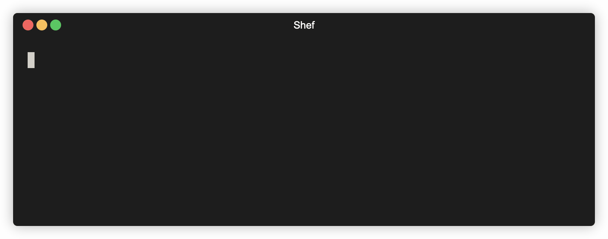

# Shef

Shef, a wordplay on *"shell"* and *"chef"*, is a powerful CLI tool for cooking up advanced shell recipes.

Essentially, imagine that [Make](https://www.gnu.org/software/make), [GitHub Actions](https://github.com/features/actions),
and [CyberChef](https://gchq.github.io/CyberChef) had a weird little `<moira-rose>bea-by</>`.

Shef allows you to pipe commands together, add interactive user prompts, loop using complex control structures,
and build reusable workflows with advanced conditional logic.

## Quick Start Example

The following example showcases a simple Shef recipe, giving you a quick glance at the syntax and functionality.



```yaml
recipes:
  - name: "conditional"
    description: "A simple demo of conditional operations using direct prompt values"
    category: "demo"
    operations:
      - name: "Choose Fruit"
        id: "choose"
        command: 'echo "You selected: {{ .fruit }}"'
        prompts:
          - name: "fruit"
            type: "select"
            message: "Choose a fruit:"
            options:
              - "Apples"
              - "Oranges"

      - name: "Apple Operation"
        id: "apple"
        command: echo "This is the apple operation! 🍎"
        condition: .fruit == "Apples"

      - name: "Orange Operation"
        id: "orange"
        command: echo "This is the orange operation! 🍊"
        condition: .fruit == "Oranges"
```

## Table of Contents

- [Shef Features](#shef-features)
- [Bash Scripts and Shef: Complementary Tools](#bash-scripts-and-shef-complementary-tools)
- [Ugh. YAML? Really?](#ugh-yaml-really)
- [Installation](#installation)
- [Quick Start](#quick-start)
- [Shef Command Reference](#shef-command-reference)
- [Recipe Sources](#recipe-sources)
- [Recipe Structure](#recipe-structure)
- [Interactive Prompts](#interactive-user-prompts)
- [Transformations](#transformations)
- [Conditional Execution](#conditional-execution)
- [Branching Workflows](#branching-workflows)
- [Data Flow Between Operations](#data-flow-between-operations)
- [Control Flow Structures](#control-flow-structures)
- [Arguments and Flags](#arguments-and-flags)
- [Example Recipes](#example-recipes)
- [Creating Recipes](#creating-recipes)
- [AI-Assisted Recipe Creation](#ai-assisted-recipe-creation)
- [Troubleshooting](#troubleshooting)
- [Contributing to Shef](#contributing-to-shef)

## Shef Features

- **Command Piping**: Chain multiple commands together, passing output from one command to the next
- **Transformations**: Transform command output with powerful templating
- **Interactive Prompts**: Add user input, selections, confirmations, and more
- **Conditional Logic**: Use if/else branching based on command results
- **Control Flow**: Create dynamic workflows with loops and control structures
- **Multiple Sources and Contexts**: Use local, user, or public recipes
- **Public Recipes**: Common, useful recipes anyone can use. Browse public [recipes](https://github.com/eduardoagarcia/shef/tree/main/recipes).

## Bash Scripts and Shef: Complementary Tools

Bash scripting is a powerful and valid approach for shell automation. Shef isn't designed to replace bash scripts, but
rather provides a toolkit that compliments bash when you need specific features.

Shef implements some common tooling like built-in support for interactive prompts, conditional logic, and command
piping. This structured approach can simplify certain tasks that might require more verbose code in bash.

Consider Shef as another tool in your automation toolkit. Absolutely use bash scripts when they're the right fit, and
reach for Shef when its features align with your specific needs.

## Ugh. YAML? Really?

Sigh. Yep. Another config format. I considered several options, and YAML emerged as the most practical choice for
this particular use case. JSON lacks comments and multiline string support, which are essential when defining shell
commands and documenting workflows. XML would have been unnecessarily verbose. TOML, while nice, doesn't handle nested
structures as elegantly for complex workflows.

## Installation

### Homebrew

```bash
brew tap eduardoagarcia/tap
brew install shef

shef -v
```

### Binary

For Linux and Windows, the simplest way to install Shef is to download the pre-built binary for your platform from
the [latest release](https://github.com/eduardoagarcia/shef/releases/latest).

#### Linux / macOS

```bash
# Download the appropriate tarball for your platform
curl -L https://github.com/eduardoagarcia/shef/releases/latest/download/shef_[PLATFORM]_[ARCH].tar.gz -o shef.tar.gz

# Extract the binary
tar -xzf shef.tar.gz

# Navigate to the extracted directory
cd shef_[PLATFORM]_[ARCH]

# Make the binary executable
chmod +x shef

# Move the binary to your PATH
sudo mv shef /usr/local/bin/

# Verify installation
shef -v

# Sync public recipes
shef sync
```

Replace `[PLATFORM]` with `linux` or `darwin` (for macOS) and `[ARCH]` with your architecture (`amd64`, `arm64`).

#### Windows

1. Download the appropriate Windows ZIP file (`shef_windows_amd64.zip` or `shef_windows_arm64.zip`) from the [releases page](https://github.com/eduardoagarcia/shef/releases/latest)
2. Extract the archive using Windows Explorer, 7-Zip, WinRAR, or similar tool
3. Move the extracted executable to a directory in your PATH
4. Open Command Prompt or PowerShell and run `shef -v` to verify installation
5. Run `shef sync` to download recipes

### Verify Binaries

> [!IMPORTANT]
> Always verify the integrity of downloaded binaries for security. The release assets are signed with GPG, and you can
> verify them using [the public key found in the repository](https://raw.githubusercontent.com/eduardoagarcia/shef/main/keys/shef-binary-gpg-public-key.asc).

#### Linux / macOS

```bash
# Import the GPG public key
curl -L https://raw.githubusercontent.com/eduardoagarcia/shef/main/keys/shef-binary-gpg-public-key.asc | gpg --import

# Download the signature file
curl -L https://github.com/eduardoagarcia/shef/releases/latest/download/shef_[OS]_[ARCH].tar.gz.asc -o shef.tar.gz.asc

# Verify the tarball
gpg --verify shef.tar.gz.asc shef.tar.gz
```

#### Windows

```bash
# Import the GPG public key (requires GPG for Windows)
Invoke-WebRequest -Uri "https://raw.githubusercontent.com/eduardoagarcia/shef/main/keys/shef-binary-gpg-public-key.asc" -OutFile "shef-key.asc"
gpg --import shef-key.asc

# Download the signature file
Invoke-WebRequest -Uri "https://github.com/eduardoagarcia/shef/releases/latest/download/shef_windows_amd64.zip.asc" -OutFile "shef_windows_amd64.zip.asc"

# Verify the ZIP file
gpg --verify shef_windows_amd64.zip.asc shef_windows_amd64.zip
```

### Package Managers

> [!NOTE]
> Future package manager support:
> - APT (Debian/Ubuntu)
> - YUM/DNF (RHEL/Fedora)
> - Arch User Repository (AUR)
> - Chocolatey/Scoop (Windows)

### Manual Installation

For developers or users who prefer to build from source:

```bash
git clone https://github.com/eduardoagarcia/shef.git
cd shef

# Install (requires sudo for system-wide installation)
make install

shef -v
```

## Quick Start

Once Shef is installed, you are ready to begin using it.

```bash
# Sync all public recipes locally
shef sync

# Run the Hello World recipe
shef demo hello-world

# List available recipes (demo recipes are excluded by default)
shef ls

# List all recipes within a category
shef ls demo
```

## Shef Command Reference

### Basic Shef Command Structure

```
shef [category] [recipe-name]
```

### Global Flags

| Flag                  | Description                |
|-----------------------|----------------------------|
| `-h, --help`          | Show help information      |
| `-v, --version`       | Show version information   |
| `-d, --debug`         | Enable debug output        |
| `-c, --category`      | Specify a category         |
| `-L, --local`         | Force local recipes first  |
| `-U, --user`          | Force user recipes first   |
| `-P, --public`        | Force public recipes first |
| `-r, --recipe-file`   | Path to the recipe file    |

### Utility Commands

| Command         | Description                                                           |
|-----------------|-----------------------------------------------------------------------|
| `sync`          | Sync public recipes locally                                           |
| `list` `ls` `l` | List available recipes (note: `demo` recipes are excluded by default) |

## Recipe Sources

Shef looks for recipes in multiple locations and contexts:

### Standard Paths (All Platforms)

1. **Local Recipes**: `./.shef/*.yaml` in the current directory
2. **User Recipes**: `~/.shef/user/*.yaml` in your home directory
3. **Public Recipes**: `~/.shef/public/*.yaml` in your home directory

### XDG Base Directory Paths (Linux Only)

On Linux systems, Shef also supports the XDG Base Directory Specification:

1. **User Recipes**: `$XDG_CONFIG_HOME/shef/user/*.yaml` (defaults to `~/.config/shef/user/*.yaml`)
2. **Public Recipes**: `$XDG_DATA_HOME/shef/public/*.yaml` (defaults to `~/.local/share/shef/public/*.yaml`)

Shef includes both standard and XDG paths on Linux systems.

### Source Priority

If you have recipes with the same name and category in different locations, you can prioritize a specific source:

```bash
shef -L git version  # Prioritize local recipes
shef -U git version  # Prioritize user recipes
shef -P git version  # Prioritize public recipes
```

## Recipe Structure

Recipes are defined in YAML files:

```yaml
recipes:
  - name: "example"
    description: "An example recipe"
    category: "demo"
    operations:
      - name: "First Operation"
        id: "first_op"
        command: echo "Hello, World!"

      - name: "Second Operation"
        command: cat
        transform: "{{ filter .input 'Hello' }}"
```

### Key Recipe Components

- **name**: Unique identifier for the recipe
- **description**: Human-readable description
- **category**: Used for organization and filtering
- **author**: Optional author attribution
- **operations**: List of operations to execute in sequence

### Operations

Operations are the building blocks of recipes:

```yaml
- name: "Operation Name"            # Operation name
  id: "unique_id"                   # Identifier for referencing output
  command: echo "Hello"             # Shell command to execute
  execution_mode: "standard"        # [Optional] How the command runs (standard, interactive, or stream)
  output_format: "raw"              # [Optional] How to format command output (raw, trim, or lines)
  silent: false                     # [Optional] Whether to suppress output to stdout
  exit: false                       # [Optional] When set to true, the recipe will exit after the operation completes
  condition: .var == true           # [Optional] Condition for execution
  on_success: "success_op"          # [Optional] Operation to run on success
  on_failure: "failure_op"          # [Optional] Operation to run on failure
  transform: "{{ .output | trim }}" # [Optional] Transform output
  prompts:                          # [Optional] Interactive prompts
     - name: "var_name"
       type: "input"
       message: "Enter value:"
  control_flow:                     # [Optional] Control flow structure (one of the below types)
    type: "foreach"                 # Type of control flow (foreach, for, while)
  operations:                       # [Optional] Sub-operations for when control flow structures are used
    - name: "Sub Operation"
      command: echo "Processing " {{ .item }}
```

#### Execution Modes

- **standard**: Default mode (used when no execution_mode is specified). Output is captured and can be used by
  subsequent operations.
- **interactive**: The command has direct access to the terminal's stdin, stdout, and stderr. Useful for commands that
  require direct terminal interaction, but output cannot be captured for use in subsequent operations.
- **stream**: Similar to interactive mode but optimized for long-running processes that produce continuous output. The
  command's output streams to the terminal in real-time, but output cannot be captured for use in subsequent operations.

#### Output Format

Shef provides options for controlling how whitespace and empty lines are handled in command output:

- **raw**: The default mode. Preserves all whitespace and newlines exactly as produced by the command, behaving like a
  standard bash script.
- **trim**: Removes leading and trailing whitespace and newlines from the command output, useful for cleaner output when
  exact formatting isn't needed.
- **lines**: Splits the output by newlines, trims each line, removes empty lines, and joins them back together. Useful
  for processing lists where empty lines and whitespace should be ignored.

##### Example Usage

```yaml
operations:
  - name: "Get file content with preserved formatting"
    id: "read_file"
    command: cat config.yaml
    output_format: "raw"  # Preserves all whitespace and newlines

  - name: "Get version number"
    id: "get_version"
    command: echo "  v1.2.3\n\n"
    output_format: "trim"  # Result: "v1.2.3"

  - name: "Get clean list of items"
    id: "list_items"
    command: echo "  item1  \n\n\n\n\n      item2  \n\n  item3    "
    output_format: "lines"  # Result: "item1\nitem2\nitem3"
```

#### Control Flow Configuration

Control flow structures are configured as follows:

##### Foreach

```yaml
control_flow:
  type: "foreach"               # Iterate over a collection
  collection: "Item 1\nItem 2"  # Collection of items (newline separated)
  as: "item"                    # Variable name for current item
```

##### For

```yaml
control_flow:
  type: "for"    # Execute a fixed number of times
  count: 5       # Number of iterations
  variable: "i"  # Variable name for iteration index (optional)
```

##### While

```yaml
control_flow:
  type: "while"                          # Execute while condition is true
  condition: "{{ ne .status `ready` }}"  # Condition to evaluate each iteration
```

## Interactive User Prompts

Shef supports the following types of user prompts:

### Basic Input Types

```yaml
# Text Input
- name: "username"
  type: "input"
  message: "Enter your username:"
  default: "admin"
  help_text: "This will be used for authentication"

# Selection
- name: "environment"
  type: "select"
  message: "Select environment:"
  options:
    - "dev"
    - "staging"
    - "production"
  default: "dev"
  help_text: "Choose the deployment environment"

# Confirmation (yes/no)
- name: "confirm_deploy"
  type: "confirm"
  message: "Deploy to production?"
  default: "false"
  help_text: "This will start the deployment process"

# Password (input is masked)
- name: "password"
  type: "password"
  message: "Enter your password:"
  help_text: "Your input will be hidden"
```

### Advanced Input Types

```yaml
# Multi-select
- name: "features"
  type: "multiselect"
  message: "Select features to enable:"
  options:
    - "logging"
    - "metrics"
    - "debugging"
  default: "logging,metrics"
  help_text: "Use space to toggle, enter to confirm"

# Numeric Input
- name: "count"
  type: "number"
  message: "Enter number of instances:"
  default: "3"
  min_value: 1
  max_value: 10
  help_text: "Value must be between 1 and 10"

# File Path Input
- name: "config_file"
  type: "path"
  message: "Select configuration file:"
  default: "./config.json"
  file_extensions:
    - "json"
    - "yaml"
    - "yml"
  required: true
  help_text: "File must exist and have the right extension"

# Text Editor
- name: "description"
  type: "editor"
  message: "Enter a detailed description:"
  default: "# Project Description\n\nEnter details here..."
  editor_cmd: "vim"  # Uses $EDITOR env var if not specified
  help_text: "This will open your text editor"

# Autocomplete Selection
- name: "service"
  type: "autocomplete"
  message: "Select a service:"
  options:
    - "authentication"
    - "database"
    - "storage"
    - "analytics"
  help_text: "Type to filter options"
```

### Dynamic Options

You can generate selection options from a previous operation's output:

```yaml
- name: "List Files"
  id: "files_list"
  command: find . -name "*.go"

- name: "Select File"
  command: cat {{ .file }}
  prompts:
    - name: "file"
      type: "select"
      message: "Select a file:"
      source_operation: "files_list"
      source_transform: "{{ .input | trim }}"
```

## Transformations

Transformations let you modify a command's output before it's passed to the next operation or used in prompts.

> [!IMPORTANT]
> In Go templates (which Shef uses), parameters are passed in the order they appear in the function call. When using pipe
> syntax (`|`), the piped value becomes the **last parameter** of the function, not the first as in many template engines.

### Basic Syntax

#### Direct function call (recommended for clarity)

```yaml
transform: "{{ function1 .output param1 }}"
```

#### Pipe syntax (parameters flipped - piped value becomes last parameter)

```yaml
transform: "{{ param1 | function1 .output }}"
```

### Available Transformation Functions

| Function        | Description                        | Parameters                 | Direct Example                        | Pipe Example                           | Input                  | Output                   |
|-----------------|------------------------------------|----------------------------|---------------------------------------|----------------------------------------|------------------------|--------------------------|
| `trim`          | Remove whitespace                  | (string)                   | `{{ trim .output }}`                  | `{{ .output \| trim }}`                | `"  hello  "`          | `"hello"`                |
| `split`         | Split string by delimiter          | (string, delimiter)        | `{{ split .output "," }}`             | `{{ "," \| split .output }}`           | `"a,b,c"`              | `["a", "b", "c"]`        |
| `join`          | Join array with delimiter          | (array, delimiter)         | `{{ join .array "," }}`               | `{{ "," \| join .array }}`             | `["a", "b", "c"]`      | `"a,b,c"`                |
| `joinArray`     | Join any array type with delimiter | (array, delimiter)         | `{{ joinArray .array ":" }}`          | `{{ ":" \| joinArray .array }}`        | `[1, 2, 3]`            | `"1:2:3"`                |
| `trimPrefix`    | Remove prefix from string          | (string, prefix)           | `{{ trimPrefix .output "pre" }}`      | `{{ "pre" \| trimPrefix .output }}`    | `"prefix"`             | `"fix"`                  |
| `trimSuffix`    | Remove suffix from string          | (string, suffix)           | `{{ trimSuffix .output "fix" }}`      | `{{ "fix" \| trimSuffix .output }}`    | `"prefix"`             | `"pre"`                  |
| `contains`      | Check if string contains pattern   | (string, substring)        | `{{ contains .output "pat" }}`        | `{{ "pat" \| contains .output }}`      | `"pattern"`            | `true`                   |
| `replace`       | Replace text                       | (string, old, new)         | `{{ replace .output "old" "new" }}`   | `{{ "old" \| replace .output "new" }}` | `"oldtext"`            | `"newtext"`              |
| `filter`/`grep` | Keep lines containing a pattern    | (string, pattern)          | `{{ filter .output "err" }}`          | `{{ "err" \| filter .output }}`        | `"error\nok\nerror2"`  | `"error\nerror2"`        |
| `cut`           | Extract field from each line       | (string, delimiter, field) | `{{ cut .output ":" 1 }}`             | `{{ ":" \| cut .output 1 }}`           | `"name:value"`         | `"value"`                |
| `atoi`          | Convert string to int              | (string)                   | `{{ atoi .output }}`                  | `{{ .output \| atoi }}`                | `"42"`                 | `42`                     |
| `add`           | Add numbers                        | (num1, num2)               | `{{ add 5 3 }}` or `{{ add .num 5 }}` | `{{ 5 \| add 3 }}`                     | `5, 3`                 | `8`                      |
| `sub`           | Subtract numbers                   | (num1, num2)               | `{{ sub 10 4 }}`                      | `{{ 4 \| sub 10 }}`                    | `10, 4`                | `6`                      |
| `div`           | Divide numbers                     | (num1, num2)               | `{{ div 10 2 }}`                      | `{{ 2 \| div 10 }}`                    | `10, 2`                | `5`                      |
| `mul`           | Multiply numbers                   | (num1, num2)               | `{{ mul 6 7 }}`                       | `{{ 7 \| mul 6 }}`                     | `6, 7`                 | `42`                     |
| `exec`          | Execute command                    | (command)                  | `{{ exec "date" }}`                   | N/A                                    | `"date"`               | Output of `date` command |
| `color`         | Add color to text                  | (color, text)              | `{{ color "green" "Success!" }}`      | `{{ "Success!" \| color "green" }}`    | `"green", "Success!"`  | Green-colored "Success!" |
| `style`         | Add styling to text                | (style, text)              | `{{ style "bold" "Important!" }}`     | `{{ "Important!" \| style "bold" }}`   | `"bold", "Important!"` | Bold "Important!"        |
| `resetFormat`   | Reset colors and styles            | ()                         | `{{ resetFormat }}`                   | N/A                                    | N/A                    | ANSI reset code          |

### Recommended Practices

1. **Use direct function calls for clarity** rather than pipe syntax, especially for functions that take multiple
   parameters
2. **For standard Go functions like `trimPrefix`**, remember they follow Go's parameter ordering:
   ```go
   // In standard Go
   strings.TrimPrefix(str, prefix)

   // In templates (direct call)
   {{ trimPrefix .output "[" }}  // CORRECT

   // In templates (pipe syntax) - CAUTION: parameters are reversed!
   {{ "[" | trimPrefix .output }}  // CORRECT but confusing
   {{ .output | trimPrefix "[" }}  // INCORRECT - will try to remove .output from "["
   ```

### Function Groups

#### String Manipulation (Standard Go functions)

- `trim`, `trimPrefix`, `trimSuffix`, `split`, `join`, `contains`, `replace`

#### Array Operations

- `joinArray` (works with arrays of any type, unlike `join` which is for string arrays)

#### Text Processing

- `filter`/`grep`, `cut`

#### Numeric Operations

- `atoi`, `add`, `sub`, `div`, `mul`

#### Shell Integration

- `exec`

#### Formatting

- `color`, `style`, `resetFormat`

### Terminal Colors and Styles

You can make your recipe outputs more readable by adding colors and styles. These are automatically disabled when using
the `NO_COLOR` environment variable.

#### Available Colors

| Color Type        | Available Colors                                                                              |
|-------------------|-----------------------------------------------------------------------------------------------|
| Text Colors       | `black`, `red`, `green`, `yellow`, `blue`, `magenta`, `cyan`, `white`                         |
| Background Colors | `bg-black`, `bg-red`, `bg-green`, `bg-yellow`, `bg-blue`, `bg-magenta`, `bg-cyan`, `bg-white` |

#### Available Styles

| Style       | Description     |
|-------------|-----------------|
| `bold`      | Bold text       |
| `dim`       | Dimmed text     |
| `italic`    | Italic text     |
| `underline` | Underlined text |

#### Using Colors and Styles

Colors and styles can be used in commands, transformations, and anywhere templates are rendered:

##### Basic Color Usage

```yaml
command: echo {{ color "green" "Success!" }}
```

##### Basic Style Usage

```yaml
command: echo {{ style "bold" "Important!" }}
```

##### Combine Color and Style

```yaml
command: echo {{ style "bold" (color "red" "Error!") }}
 ```

##### Transformations

```yaml
transform: |
  {{ if contains .output "error" }}
  {{ color "red" (style "bold" "✗ Operation failed") }}
  {{ else }}
  {{ color "green" (style "bold" "✓ Operation succeeded") }}
  {{ end }}
```

### Accessing Variables

You can access all context variables in transformations:

```yaml
transform: "{{ if eq .format `json` }}{{ .output }}{{ else }}{{ .output | cut ` ` 0 }}{{ end }}"
```

Variables available in templates:

- `.output`: The output to the current transformation (output from the command)
- `.input`: The input to the current command (input from previous operation or the input from the command line)
- `.{variable_name}`: Any variable, argument, or flag
- `.{prompt_name}`: Any variable from defined prompts
- `.{operation_id}`: The output of a specific operation by ID
- `.operationOutputs`: Map of all operation outputs by ID
- `.operationResults`: Map of operation success/failure results by ID

> [!NOTE]
> Undefined variables will always evaluate to the boolean value of `false`

## Conditional Execution

Operations can be conditionally executed:

### Basic Conditions

```yaml
condition: .confirm == "true"  # Run only if confirm prompt is true
```

### Operation Result Conditions

```yaml
condition: build_op.success  # Run if build_op succeeded
condition: test_op.failure   # Run if test_op failed
```

### Variable Comparison

```yaml
condition: .environment == "production"  # Equality check
condition: .count != 0                   # Inequality check
```

### Numeric Comparison

```yaml
condition: .count > 5
condition: .memory <= 512
condition: .errors >= 10
condition: .progress < 100
```

### Complex Logic

```yaml
condition: build_op.success && .confirm_deploy == "true"
condition: test_op.failure || lint_op.failure
condition: !.skip_validation
```

## Branching Workflows

You can create branching workflows based on success or failure:

```yaml
- name: "Build App"
  id: "build_op"
  command: make build
  on_success: "deploy_op"  # Go to deploy_op on success
  on_failure: "fix_op"     # Go to fix_op on failure

- name: "Deploy"
  id: "deploy_op"
  command: make deploy
  
- name: "Fix Issues"
  id: "fix_op"
  command: make lint
```

## Data Flow Between Operations

Each operation's output is automatically piped to the next operation's input. You can also access any operation's output
by its ID:

```yaml
- name: "Get Hostname"
  id: "hostname_op"
  command: hostname

- name: "Show Info"
  command: echo "Running on " {{ .hostname_op }}
```

## Control Flow Structures

Shef supports advanced control flow structures that let you create dynamic, iterative workflows.

### Foreach Loops

You can iterate over a collection of items and perform a flow of operations on each item.

#### Key Foreach Components

- **control_flow**
    - **type**: foreach
    - **collection**: The list of items to iterate over (string with items separated by newlines)
    - **as**: The variable name to use for the current item in each iteration
- **operations**: The sub-operations to perform for each item (all sub-operations have access to the `as` loop variable)

#### Mechanics of the Foreach Loop

1. Parse the collection into separate items (splitting by newlines)
2. For each item, set the variable specified in "as"
3. Execute all operations in the foreach block for each item
4. Clean up the loop variable when done

#### Common Uses

- Processing multiple files
- Handling lists of servers, containers, or resources
- Applying the same transformation to multiple inputs
- Building dynamic workflows based on discovered items

> [!TIP]
> Within a foreach loop, you can use conditional operations, transformations, and all other Shef features.

#### Example Foreach Recipes

```yaml
- name: "Process Each Item"
  control_flow:
     type: "foreach"
     collection: "🍎 Apples\n🍌 Bananas\n🍒 Cherries\n🍊 Oranges"
     as: "fruit"  # Each item will be available as .fruit
  operations:
     - name: "Process Fruit"
       command: echo "Processing " {{ .fruit }}
```

You can also generate the collection dynamically:

```yaml
- name: "List Files"
  id: "files"
  command: find . -type f -name "*.txt"

- name: "Process Each File"
  control_flow:
    type: "foreach"
    collection: "{{ .files }}"  # Using output from previous operation
    as: "file"                  # Each item will be available as .file
  operations:
    - name: "Process File"
      command: cat {{ .file }} | wc -l
```

### For Loops

You can execute a set of operations a fixed number of times.

#### Key For Loop Components

- **control_flow**
    - **type**: for
    - **count**: The number of iterations to execute
    - **variable**: (Optional) The variable name to use for the current iteration index (defaults to "i")
- **operations**: The sub-operations to perform for each iteration

#### Mechanics of the For Loop

1. Parse and evaluate the count value to determine the number of iterations
2. For each iteration, set the loop variable to the current index (starting from 0)
3. Also set the `.iteration` variable to the 1-based iteration number
4. Execute all operations in the operations block for each iteration
5. Clean up the loop variables when done

#### Common Uses

- Repeating an operation a fixed number of times
- Creating numbered resources or items
- Running tests multiple times
- Implementing retry logic with a maximum attempt limit

> [!TIP]
> Within a for loop, both the specified variable (zero-based index) and `.iteration` (one-based counter) are available.

#### Example For Loop Recipes

```yaml
- name: "Run a For Loop"
  control_flow:
    type: "for"
    count: 5
    variable: "i"
  operations:
    - name: "Print Iteration"
      command: 'echo "Running iteration {{ .iteration }} (zero-based index: {{ .i }})"'
```

You can also use a dynamic count:

```yaml
- name: "Get Count"
  id: "count"
  command: echo "3"
  transform: "{{ trim .input }}"

- name: "Dynamic For Loop"
  control_flow:
    type: "for"
    count: "{{ .count }}"
    variable: "step"
  operations:
    - name: "Execute Step"
      command: echo "Executing step {{ .step }} of {{ .count }}"
```

### While Loops

You can repeatedly execute operations as long as a condition remains true.

#### Key While Loop Components

- **control_flow**
    - **type**: while
    - **condition**: The condition to evaluate before each iteration
- **operations**: The sub-operations to perform for each iteration

#### Mechanics of the While Loop

1. Evaluate the condition before each iteration
2. If the condition is true, execute the operations and repeat
3. If the condition is false, exit the loop
4. An `.iteration` variable is automatically set to track the current iteration (starting from 1)
5. A safety limit prevents infinite loops (maximum 1000 iterations)

#### Common Uses

- Polling for a condition (e.g., waiting for a service to be ready)
- Processing data until a certain state is reached
- Implementing retry logic with conditional termination
- Continuously monitoring resources until a specific event occurs

> [!TIP]
> Within a while loop, the `.iteration` variable lets you track how many iterations have occurred.

#### Example While Loop Recipes

```yaml
- name: "Initialize Status"
  id: "status"
  command: echo "running"
  transform: "{{ trim .input }}"
  silent: true

- name: "Wait For Completion"
  control_flow:
    type: "while"
    condition: "{{ contains .status `running` }}"
  operations:
    - name: "Check Status"
      command: echo "Checking status (iteration {{ .iteration }})..."
      id: "status"
      transform: "{{ if eq .iteration 5 }}completed{{ else }}running{{ end }}"
```

Real-world polling example:

```yaml
- name: "Poll Service Until Ready"
  control_flow:
    type: "while"
    condition: "{{ ne .status `ready` }}"
  operations:
    - name: "Check Service Status"
      command: curl -s http://service/status
      id: "status"
      transform: "{{ trim .input }}"
```

## Arguments and Flags

Shef allows you to pass arguments and flags directly to your recipes from the command line.

### Basic Argument Syntax

```
shef [category] [recipe-name] [input-text] [flags...]
```

or without category:

```
shef [recipe-name] [input-text] [flags...]
```

### Available Flag Types

| Flag Type           | Example               | Variable         | Value           |
|---------------------|-----------------------|------------------|-----------------|
| Input Text          | `"Hello World"`       | `.input`         | `"Hello World"` |
| Short Flag          | `-f`                  | `.f`             | `true`          |
| Long Flag           | `--name=John`         | `.name`          | `"John"`        |
| Long Flag with dash | `--user-agent=Chrome` | `.user_agent`    | `"Chrome"`      |
| Multi-short         | `-abc`                | `.a`, `.b`, `.c` | `true`          |

### Usage Examples

```bash
# Pass text input to a recipe
shef demo arguments "Hello World"

# Pass a boolean flag
shef demo arguments -f

# Pass a value flag
shef demo arguments --name=John

# Combine multiple types
shef demo arguments "My input text" -vf -a --count=5 --verbose
```

### Accessing Arguments in Recipes

You can access these values in your recipe operations:

```yaml
- name: "Display Arguments"
  command: |
    echo "Input: {{ .input }}"
    echo "Flag f: {{ .f }}"
    echo "Name: {{ .name }}"

- name: "Conditional based on flag"
  command: echo "Flag was set!"
  condition: .f == true
```

## Example Recipes

### Hello World

```yaml
recipes:
  - name: "hello-world"
    description: "A simple hello world recipe"
    category: "demo"
    operations:
      - name: "Greet User"
        command: |
          echo "Hello, {{ .name }}!"
          echo "Current time: $(date)"
          echo "Welcome to Shef, the shell recipe tool."
        prompts:
          - name: "name"
            type: "input"
            message: "What is your name?"
            default: "World"
```

### Success and Error Handling

```yaml
recipes:
  - name: "handlers"
    description: "A simple demo of error and success handlers"
    category: "demo"
    operations:
      - name: "Help"
        command: echo {{ color "magenta" "Please provide a valid or invalid directory argument to test" }}
        condition: .input == "false"

      - name: "Test if directory exists"
        command: cd {{ .input }}
        on_failure: "handle_error"
        on_success: "handle_success"
        condition: .input != "false"

      - name: "Handle error"
        id: "handle_error"
        command: echo {{ color "red" (printf "Directory %s does NOT exist!" .input) }}

      - name: "Handle success"
        id: "handle_success"
        command: echo {{ color "green" (printf "Directory %s exists!" .input) }}

```

### Transform Pipeline

```yaml
recipes:
  - name: "transform"
    description: "A simple demo of data transformation and pipeline flow"
    category: "demo"
    operations:
      - name: "Generate a Simple List"
        id: "generate"
        command: |
          echo "apple
          banana
          cherry
          dragonfruit
          eggplant"

      - name: "Filter 'a' Items"
        id: "filter_a"
        command: cat
        transform: '{{ filter .generate "a" }}'
        silent: true

      - name: "Display 'a' Results"
        id: "display_a"
        command: echo "Items containing 'a':\n{{ color "green" .filter_a }}"
```

## Creating Recipes

To create your own recipes:

1. Create your user directory: `mkdir -p ~/.shef/user` (if it does not already exist)
2. Create a new YAML file: `touch ~/.shef/user/my-recipes.yaml`
3. Build and develop your recipes following the instructions above
4. Run `shef ls` to see your new recipes

## AI-Assisted Recipe Creation

You can generate powerful Shef recipes quickly using AI tools like ChatGPT, Claude, or other large language models.

### Using AI to Create Recipes

1. Copy the prompt below
2. Paste it into your AI assistant of choice
3. Replace `[DESCRIBE YOUR WORKFLOW IN DETAIL]` with a detailed description of your recipe's workflow
4. The AI will generate a complete Shef recipe based on your description
5. Test and iterate until the recipe works as expected

### Example Usage

Here's an example of how to fill in your workflow description:

```
I need a Docker management workflow that helps me clean up unused containers and images to free up disk space.

The workflow should:
1. Show the current Docker disk usage
2. List all stopped containers and allow me to select which ones to remove
3. Confirm before removing the selected containers
4. List dangling images (unused) and allow me to select which ones to remove
5. Offer an option to perform a more aggressive cleanup (removing all unused images)
6. Show before/after disk usage comparison
7. Include error handling in case any operation fails

The recipe should be interactive and safe, requiring confirmation before any destructive operations.
```

### Tips for Better Results

- Use the latest AI models with advanced reasoning capabilities
- Be specific about what commands should be executed at each step
- Mention if you need interactive prompts, conditions, or transformations
- For complex workflows, break down your requirements into clear, logical steps
- Include any specific error handling or conditional branches you need
- Request comments in the generated recipe to explain complex sections
- Ask the AI to analyze and iterate on its recipe solution, considering edge cases and improvements
- If the first recipe doesn't fully meet your needs, refine your requirements and ask for adjustments

Remember, the AI-generated recipes can provide an excellent starting point that you can further customize to fit your
exact needs.

### The Prompt

```text
I need help creating a Shef recipe. Shef is a CLI tool that combines shell commands into reusable recipes defined in YAML.

[DESCRIBE YOUR WORKFLOW IN DETAIL]

A Shef recipe is defined in YAML with this structure:

recipes:
  - name: "short-name"
    description: "Human-readable description"
    category: "category"
    author: "optional author"
    operations:
      - name: "Operation Name"
        id: "unique_id"
        command: "shell command"
        execution_mode: "standard|interactive|stream"  # How the command runs
        silent: true|false  # Whether to suppress the command's output. Default is false
        exit: true|false # Whether to exit the recipe after operation completes. Default is false
        condition: "optional condition"
        on_success: "next_op_id"
        on_failure: "fallback_op_id"
        transform: "{{ .input | transformation }}"
        prompts:
          - name: "variable_name"
            type: "input|select|confirm|password|multiselect|number|editor|path|autocomplete"
            message: "Prompt message"
            default: "Default value"
            help_text: "Additional help information"
            required: true|false  # Whether input is required
            options: ["option1", "option2"]  # For select/multiselect/autocomplete types
            source_operation: "operation_id"  # For dynamic options
            source_transform: "{{ .input | transform }}"  # For processing source options
            min_value: 0  # For number type
            max_value: 100  # For number type
            file_extensions: ["txt", "json"]  # For path type
            multiple_limit: 3  # For multiselect type
            editor_cmd: "vim"  # For editor type
        control_flow:
          type: "foreach|for|while"  # Type of control flow
          collection: "Item 1\nItem 2\nItem 3"  # Items to iterate over (foreach loops)
          as: "item"  # Variable name for current item (foreach loops)
          count: 5  # Number of iterations (for loops)
          variable: "i"  # Variable name for iteration index (for loops)
          condition: "{{ lt .counter 5 }}"  # Condition to check (while loops)
        operations:  # Operations to perform for each iteration
          - name: "Sub Operation"
            # command: "echo 'Processing {{ .item }}'" # foreach loop
            # command: "echo 'Iteration {{ .i }} of 5'" # for loop
            # command: "echo 'While iteration {{ .iteration }}'" # while loop

RECIPE MECHANICS:
1. Operations execute in sequence unless redirected by on_success/on_failure
2. Each operation's output becomes input to the next operation
3. Variables from prompts are accessible as {{ .variable_name }}
4. Operation outputs are accessible as {{ .operation_id }}
5. You can combine variables and operation outputs in command templates
6. Control flow structures like foreach allow iterating over collections

CONTROL FLOW STRUCTURES:
- foreach: Iterate over a collection of items
  - collection: Newline-separated list of items (can be fixed or from operation output)
  - as: Variable name to assign each item during iteration
  - operations: Operations to execute for each item (with access to the iteration variable)
- for: Execute operations a fixed number of times
  - count: Number of iterations to perform (can be fixed or from operation output)
  - variable: Variable name for the current zero-based index (optional, defaults to "i")
  - operations: Operations to execute for each iteration (with access to the index variable and .iteration)
- while: Execute operations as long as a condition is true
  - condition: Expression to evaluate before each iteration
  - operations: Operations to execute while the condition is true (with access to .iteration)

INTERACTIVE PROMPTS:
- input: Free text input (default: string)
- select: Choose from options (static or dynamic from previous operation)
- confirm: Yes/no boolean question
- password: Masked text input
- multiselect: Choose multiple options
- number: Numeric input with range validation
- editor: Multi-line text input in an editor
- path: File path with validation
- autocomplete: Selection with filtering

TRANSFORMATION EXAMPLES:
- Trim whitespace: {{ .input | trim }}
- Split by delimiter: {{ .input | split "," }}
- Join array: {{ .input | join "\n" }}
- Filter lines: {{ .input | filter "pattern" }} or {{ .input | grep "pattern" }}
- Extract field: {{ .input | cut ":" 1 }}
- Remove prefix/suffix: {{ .input | trimPrefix "foo" }} {{ .input | trimSuffix "bar" }}
- Check content: {{ if contains .input "pattern" }}yes{{ end }}
- Replace text: {{ .input | replace "old" "new" }}
- Math operations: {{ .input | atoi | add 5 | mul 2 | div 3 | sub 1 }}
- Execute command: {{ exec "date" }}

CONDITIONAL LOGIC:
- Variable equality: variable == "value" or variable != "value"
- Operation success/failure: operation_id.success or operation_id.failure
- Boolean operators: condition1 && condition2, condition1 || condition2, !condition
- Numeric comparison: value > 5, count <= 10
- Complex example: (check_files.success && has_tests == true) || skip_tests == true

ADVANCED FEATURES:
- Dynamic selection options from previous commands
- Conditional branching based on operation results
- Multi-step workflows with error handling
- Custom error messages and recovery steps
- Transforming outputs between operations
- Execution modes (standard or interactive)
- Silent operations that suppress output

EXAMPLE RECIPE PATTERNS:
1. Get input → Process → Show result
2. List options → Select one → Take action
3. Check condition → Branch based on result → Handle each case
4. Execute command → Transform output → Use in next command
5. Try operation → Handle success/failure differently

Please create a complete Shef recipe that accomplishes my goal, with proper indentation and comments explaining complex parts.
```

## Troubleshooting

### Common Issues

**Recipe not found**

- Check if you're using the correct name and category
- Use `shef ls` to see available recipes
- Check your recipe file syntax

**Command fails with unexpected output**

- Remember all commands run through a shell, so shell syntax applies
- Escape special characters in command strings
- Use the `transform` field to format output

**Prompt validation errors**

- Ensure minimum/maximum values are within range
- Check that file paths exist and have correct extensions
- Verify select options contain the default value

## Contributing to Shef

Thank you for taking an interest in contributing to Shef!

### Contributing Code

#### Development Setup

1. **Fork the Repository**
   ```bash
   # Fork via GitHub UI, then clone your fork
   git clone git@github.com:yourusername/shef.git
   cd shef
   ```

2. **Set Up Development Environment**
   ```bash
   # Install development dependencies
   go mod download

   # Build the development version
   go build -o shef
   ```

3. **Create a New Branch**
   ```bash
   git checkout -b my-awesome-feature
   ```

#### Development Guidelines

- **Code Style**: Follow standard Go conventions and the existing style in the codebase
- **Documentation**: Update documentation for any new features or changes
- **Commit Messages**: Write clear, descriptive commit messages explaining your changes
- **Tests**: Update tests accordingly

#### Submitting Your Changes

1. **Push to Your Fork**
   ```bash
   git push origin my-awesome-feature
   ```

2. **Create a Pull Request**: Visit your fork on GitHub and create a pull request against the main repository

3. **PR Description**: Include a clear description of what your changes do and why they should be included

4. **Code Review**: Respond to any feedback during the review process

### Contributing Recipes

Sharing your recipes helps grow the Shef ecosystem and benefits the entire community.

#### Creating Public Recipes

1. **Develop and Test Your Recipe Locally**
   ```bash
   # Create your recipe in the user directory first
   mkdir -p ~/.shef/user
   vim ~/.shef/user/my-recipe.yaml
   
   # Test thoroughly
   shef -U my-category my-recipe-name
   ```

2. **Recipe Quality Guidelines**
    - Include clear descriptions for the recipe and each operation
    - Add helpful prompts with descriptive messages and defaults
    - Handle errors gracefully
    - Follow YAML best practices
    - Comment complex transformations or conditionals

3. **Submitting Your Recipe**

   **Option 1: Via Pull Request**
    - Fork the Shef repository
    - Add your recipe to the `recipes/public/` directory
    - Create a pull request with your recipe

   **Option 2: Via Issue**
    - Create a new issue on the Shef repository
    - Attach your recipe file or paste its contents
    - Describe what your recipe does and why it's useful

#### Recipe Documentation

When submitting a recipe, include a section in your PR or issue that explains:

1. **Purpose**: What problem does your recipe solve?
2. **Usage**: How to use the recipe, including example commands
3. **Requirements**: Any special requirements or dependencies
4. **Examples**: Sample outputs or use cases

### Community Guidelines

- Be respectful of others' contributions
- Help review pull requests and test others' recipes
- Report bugs and suggest improvements
- Share your Shef success stories and use cases

### Getting Help

If you need help with your contribution, you can:

- Open an issue on GitHub
- Ask questions in the discussions section
- Reach out to me directly
