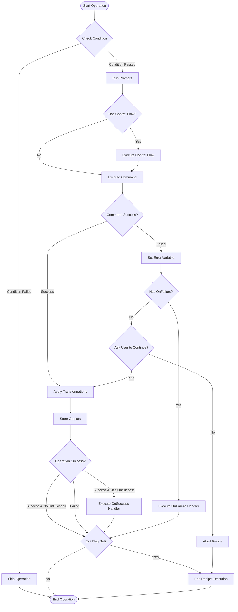

## Additional Reference

### Flow Diagram

The following diagram illustrates the execution flow for each operation:

```mermaid
flowchart TD
    Start([Start Operation]) --> ConditionCheck{Check Condition}
    ConditionCheck -- " Condition Passed " --> Prompts[Run Prompts]
    ConditionCheck -- " Condition Failed " --> Skip[Skip Operation]
    Skip --> End([End Operation])
    Prompts --> ControlFlowCheck{Has Control Flow?}
    ControlFlowCheck -- " Yes " --> ControlFlow[Execute Control Flow]
    ControlFlowCheck -- " No " --> Command
    ControlFlow --> Command[Execute Command]
    Command --> CommandStatus{Command Success?}
    CommandStatus -- " Failed " --> SetErrorVar[Set Error Variable]
    SetErrorVar --> OnFailureCheck{Has OnFailure?}
    CommandStatus -- " Success " --> Transform[Apply Transformations]
    OnFailureCheck -- " Yes " --> OnFailure[Execute OnFailure Handler]
    OnFailureCheck -- " No " --> AskUser{Ask User to Continue?}
    AskUser -- " Yes " --> Transform
    AskUser -- " No " --> Abort[Abort Recipe]
    Transform --> StoreOutputs[Store Outputs]
    StoreOutputs --> SuccessCheck{Operation Success?}
    SuccessCheck -- " Success & Has OnSuccess " --> OnSuccess[Execute OnSuccess Handler]
    SuccessCheck -- " Success & No OnSuccess " --> ExitCheck
    SuccessCheck -- " Failed " --> ExitCheck
    OnSuccess --> ExitCheck{Exit Flag Set?}
    OnFailure --> ExitCheck
    ExitCheck -- " Yes " --> EndRecipe[End Recipe Execution]
    ExitCheck -- " No " --> End
    Abort --> EndRecipe
    EndRecipe --> End
```
